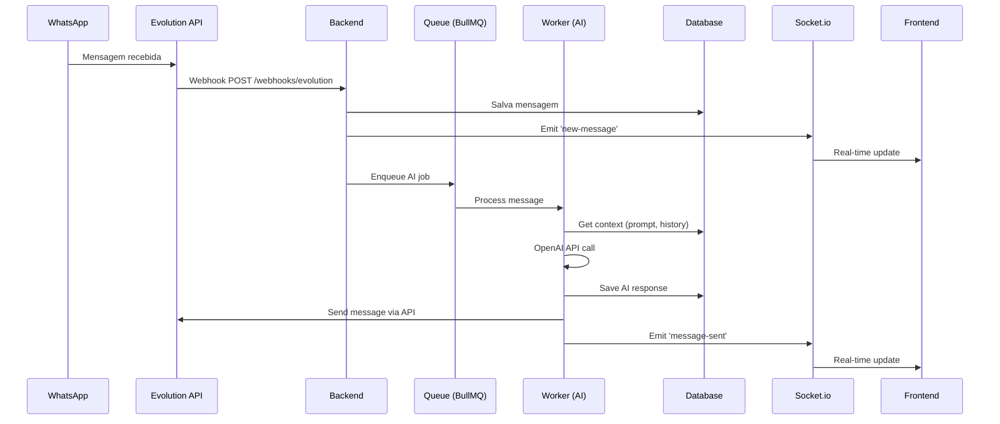
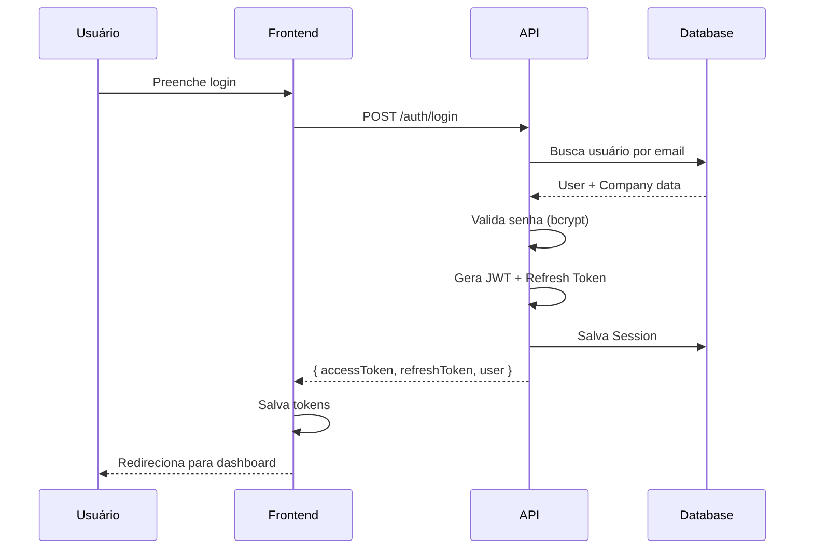

# 2. Arquitetura do Sistema

**Versão:** 1.0.0
**Última Atualização:** 2026-01-19

← [Voltar para SPEC](README.md)

---

## 2.1 Visão de Alto Nível

```
┌─────────────────────────────────────────────────────────────────────┐
│                         Cliente (Browser)                            │
│                    React + Vite + Tailwind                          │
└────────────────────────────┬────────────────────────────────────────┘
                             │ HTTPS + WebSocket
┌────────────────────────────▼────────────────────────────────────────┐
│                         Nginx / Reverse Proxy                        │
│                    (Rate Limiting, SSL, Load Balancing)             │
└────────────────────────────┬────────────────────────────────────────┘
                             │
┌────────────────────────────▼────────────────────────────────────────┐
│                         Backend Service                              │
│                    Fastify + TypeScript + Node.js                   │
│  ┌─────────────┐  ┌─────────────┐  ┌─────────────┐  ┌────────────┐ │
│  │  API Routes │  │  Socket.io  │  │  Workers    │  │  Webhooks  │ │
│  │  REST/JSON  │  │  Real-time  │  │  BullMQ     │  │  External  │ │
│  └─────────────┘  └─────────────┘  └─────────────┘  └────────────┘ │
└──┬─────────────────────┬─────────────────────┬──────────────────────┘
   │                     │                     │
   ▼                     ▼                     ▼
┌──────────┐      ┌───────────┐      ┌───────────────────────────────┐
│PostgreSQL│      │   Redis   │      │      Serviços Externos        │
│ + pgvector│      │Cache/Queue│      │ ┌─────────┐ ┌──────────────┐ │
│          │      │           │      │ │Evolution│ │   OpenAI     │ │
│  Prisma  │      │  BullMQ   │      │ │  API    │ │   GPT-4      │ │
└──────────┘      └───────────┘      │ └─────────┘ └──────────────┘ │
                                     │ ┌─────────┐ ┌──────────────┐ │
                                     │ │ UAZAPI  │ │ S3/R2 Storage│ │
                                     │ └─────────┘ └──────────────┘ │
                                     └───────────────────────────────┘
```

---

## 2.2 Componentes do Sistema

### Backend Service

| Componente | Responsabilidade | Tecnologia |
|------------|------------------|------------|
| **API Routes** | Endpoints REST | Fastify + Zod |
| **Controllers** | Lógica de requisição | TypeScript |
| **Services** | Lógica de negócio | TypeScript |
| **Repositories** | Acesso a dados | Prisma Client |
| **Workers** | Processamento assíncrono | BullMQ |
| **Socket Handler** | Real-time messaging | Socket.io |
| **Webhooks** | Recebimento de eventos externos | Fastify Routes |

### Frontend Application

| Componente | Responsabilidade | Tecnologia |
|------------|------------------|------------|
| **Pages** | Rotas da aplicação | React Router |
| **Components** | UI reutilizável | Shadcn/UI |
| **Hooks** | Lógica compartilhada | React Hooks |
| **Services** | Chamadas à API | Axios |
| **State** | Estado global | Zustand |
| **Data Fetching** | Cache e sync | TanStack Query |

### Data Layer

| Componente | Responsabilidade | Tecnologia |
|------------|------------------|------------|
| **Database** | Dados relacionais | PostgreSQL 16 |
| **Vector Store** | Embeddings para IA | pgvector |
| **Cache** | Dados temporários | Redis |
| **Queue** | Filas de processamento | BullMQ |
| **Storage** | Arquivos de mídia | S3/R2/MinIO |

---

## 2.3 Fluxo de Dados

### Fluxo de Mensagem WhatsApp



### Fluxo de Autenticação



---

## 2.4 Stack Tecnológico Detalhado

### Backend

| Tecnologia | Versão | Finalidade |
|------------|--------|------------|
| Node.js | 20.x LTS | Runtime JavaScript |
| TypeScript | 5.6.3 | Tipagem estática |
| Fastify | 4.28.1 | Framework web de alta performance |
| Prisma | 5.22.0 | ORM e migrations |
| Zod | 3.x | Validação de schemas |
| BullMQ | 5.x | Filas de jobs |
| Socket.io | 4.8.3 | Real-time WebSocket |
| Pino | 8.x | Logging estruturado |
| bcrypt | 5.x | Hash de senhas |
| jsonwebtoken | 9.x | JWT tokens |

### Frontend

| Tecnologia | Versão | Finalidade |
|------------|--------|------------|
| React | 18.3.1 | UI Library |
| TypeScript | 5.8.3 | Tipagem estática |
| Vite | 5.4.19 | Build tool |
| Tailwind CSS | 3.4.17 | Estilização utility-first |
| Shadcn/UI | Latest | Componentes UI |
| TanStack Query | 5.x | Data fetching e cache |
| React Hook Form | 7.x | Formulários |
| Zustand | 4.x | State management |
| React Router | 6.x | Roteamento |
| Socket.io-client | 4.8.3 | Real-time client |

### Infraestrutura

| Tecnologia | Versão | Finalidade |
|------------|--------|------------|
| PostgreSQL | 16.x | Banco de dados principal |
| pgvector | 0.5.x | Extensão para embeddings |
| Redis | 7.x | Cache e filas |
| Docker | 24+ | Containerização |
| Docker Compose | 2.x | Orquestração local |
| Nginx | 1.x | Reverse proxy |

---

## 2.5 Estrutura de Diretórios

### Backend (server/)

```
server/
├── src/
│   ├── modules/           # Módulos por domínio
│   │   ├── auth/          # Autenticação
│   │   ├── whatsapp/      # Integração WhatsApp
│   │   ├── contacts/      # CRM de contatos
│   │   ├── funnels/       # Funis de vendas
│   │   ├── deals/         # Oportunidades
│   │   ├── ai/            # Prompts e IA
│   │   ├── followup/      # Follow-ups
│   │   ├── flows/         # Automação
│   │   └── dashboard/     # Métricas
│   ├── workers/           # BullMQ workers
│   │   ├── message.worker.ts
│   │   ├── embedding.worker.ts
│   │   ├── flow.worker.ts
│   │   └── followup.worker.ts
│   ├── lib/               # Utilitários compartilhados
│   │   ├── prisma.ts
│   │   ├── redis.ts
│   │   ├── openai.ts
│   │   └── socket.ts
│   ├── middleware/        # Middlewares Fastify
│   │   ├── auth.ts
│   │   └── rateLimit.ts
│   └── index.ts           # Entry point
├── prisma/
│   └── schema.prisma      # Schema do banco
└── package.json
```

### Frontend (src/)

```
src/
├── components/            # Componentes reutilizáveis
│   ├── ui/               # Shadcn/UI components
│   ├── layout/           # Layout components
│   └── domain/           # Domain-specific components
├── pages/                 # Páginas/rotas
│   ├── auth/
│   ├── dashboard/
│   ├── conversations/
│   ├── contacts/
│   ├── funnels/
│   ├── deals/
│   ├── settings/
│   └── flows/
├── hooks/                 # Custom hooks
├── services/              # API services
├── stores/                # Zustand stores
├── types/                 # TypeScript types
├── utils/                 # Utilitários
└── App.tsx               # Root component
```

---

## 2.6 Padrões de Projeto

### Módulos por Domínio (Backend)

Cada módulo segue a estrutura:

```
modules/contacts/
├── contacts.routes.ts     # Definição de rotas
├── contacts.controller.ts # Handlers de requisição
├── contacts.service.ts    # Lógica de negócio
├── contacts.schema.ts     # Schemas Zod
└── contacts.types.ts      # TypeScript types
```

### Repository Pattern (via Prisma)

```typescript
// Abstração via Prisma Client
const contact = await prisma.contact.findUnique({
  where: { id, companyId },
  include: {
    tagAssignments: { include: { tag: true } },
    conversations: true
  }
});
```

### Service Layer

```typescript
class ContactsService {
  async create(data: CreateContactDTO, companyId: string) {
    // Validação de negócio
    const existing = await prisma.contact.findFirst({
      where: { phone: data.phone, companyId }
    });
    if (existing) throw new ConflictError('Contact already exists');

    // Criação
    return prisma.contact.create({
      data: { ...data, companyId }
    });
  }
}
```

---

## 2.7 Comunicação Entre Componentes

### Síncrona (Request/Response)

- **HTTP REST** para comunicação cliente-servidor
- **JSON** como formato de dados
- **Validação** com Zod schemas
- **Rate limiting** por IP/usuário

### Assíncrona (Queue-based)

- **BullMQ** para jobs em segundo plano
- **Retry automático** com exponential backoff
- **Dead Letter Queue** para falhas persistentes

### Real-time (WebSocket)

- **Socket.io** para eventos em tempo real
- **Namespaces** por empresa (multi-tenant)
- **Rooms** por conversa/usuário
- **Eventos:** `new-message`, `message-sent`, `contact-updated`, `notification`

### Webhooks (External)

- **Evolution API** envia eventos de mensagens
- **UAZAPI** como provedor alternativo
- **Validação de assinatura** para segurança

---

## 2.8 Diagrama de Deployment

```
┌─────────────────────────────────────────────────────────────────────┐
│                         Ambiente de Produção                         │
├─────────────────────────────────────────────────────────────────────┤
│                                                                      │
│   ┌─────────────────┐    ┌─────────────────┐                       │
│   │    Frontend     │    │     Backend     │                       │
│   │   (Vercel/CDN)  │    │   (VPS/Docker)  │                       │
│   │                 │    │                 │                       │
│   │   React + Vite  │    │  Fastify + Node │                       │
│   └─────────────────┘    └────────┬────────┘                       │
│                                   │                                 │
│         ┌─────────────────────────┼─────────────────────────┐      │
│         │                         │                         │      │
│         ▼                         ▼                         ▼      │
│   ┌───────────┐           ┌───────────┐           ┌───────────┐   │
│   │ PostgreSQL│           │   Redis   │           │  Storage  │   │
│   │ (Managed) │           │ (Managed) │           │  (S3/R2)  │   │
│   │           │           │           │           │           │   │
│   │ + pgvector│           │ + BullMQ  │           │   Media   │   │
│   └───────────┘           └───────────┘           └───────────┘   │
│                                                                      │
└─────────────────────────────────────────────────────────────────────┘

Serviços Externos:
┌───────────┐  ┌───────────┐  ┌───────────┐
│ Evolution │  │  OpenAI   │  │   UAZAPI  │
│    API    │  │  GPT-4    │  │  (backup) │
└───────────┘  └───────────┘  └───────────┘
```

---

## 2.9 Considerações de Segurança

### Autenticação

- JWT com expiração curta (15 min access, 7d refresh)
- Tokens armazenados em httpOnly cookies ou localStorage
- Refresh token rotation

### Autorização

- RBAC por empresa (owner, admin, member)
- Permissões granulares via JSON
- Isolamento multi-tenant obrigatório

### Proteção

- TLS/HTTPS obrigatório
- Rate limiting por IP (100 req/min)
- Input validation com Zod
- CORS configurado por ambiente
- Headers de segurança (Helmet)
- Sanitização de output

### Dados

- Senhas com bcrypt (10+ rounds)
- API keys criptografadas
- Logs sem PII sensível
- Backups criptografados

---

← [Voltar para SPEC](README.md) | [Próximo: Modelo de Dados →](03-modelo-dados.md)
