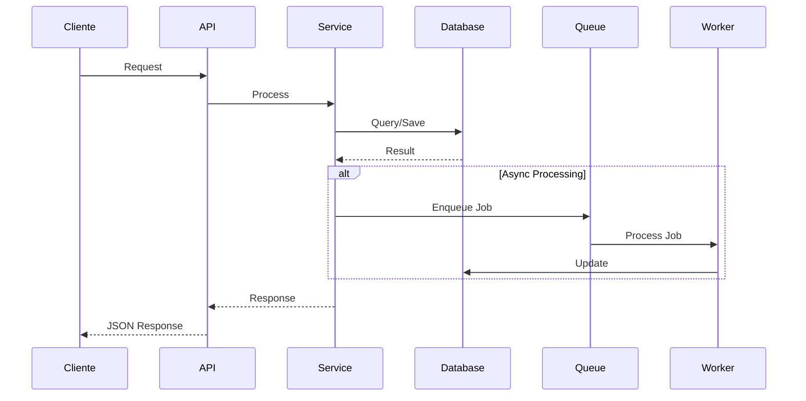

# 2. Arquitetura do Sistema

**Versão:** 1.0.0
**Última Atualização:** {{DATA}}

← [Voltar para SPEC](README.md)

---

## 2.1 Visão de Alto Nível

```
┌─────────────────────────────────────────────────────────┐
│                    Cliente (Browser/App)                 │
└────────────────────────┬────────────────────────────────┘
                         │ HTTPS
┌────────────────────────▼────────────────────────────────┐
│                    Load Balancer                         │
└────────────────────────┬────────────────────────────────┘
                         │
┌────────────────────────▼────────────────────────────────┐
│                    API Gateway                           │
│            (Rate Limiting, Auth, Logging)               │
└────────────────────────┬────────────────────────────────┘
                         │
┌────────────────────────▼────────────────────────────────┐
│                    Backend Service                       │
│                (Node.js / TypeScript)                   │
│  ┌──────────┐  ┌──────────┐  ┌──────────┐              │
│  │  API     │  │  Workers │  │  Jobs    │              │
│  │  Routes  │  │  BullMQ  │  │  Cron    │              │
│  └──────────┘  └──────────┘  └──────────┘              │
└──┬─────────────────┬─────────────────┬──────────────────┘
   │                 │                 │
   ▼                 ▼                 ▼
┌──────┐      ┌─────────┐      ┌──────────────┐
│Postgre│      │  Redis  │      │  Serviços    │
│  SQL  │      │  Cache  │      │  Externos    │
└──────┘      └─────────┘      └──────────────┘
```

---

## 2.2 Componentes do Sistema

### Backend Service

| Componente | Responsabilidade | Tecnologia |
|------------|------------------|------------|
| API Routes | Endpoints REST | Express/Fastify |
| Controllers | Lógica de requisição | TypeScript |
| Services | Lógica de negócio | TypeScript |
| Repositories | Acesso a dados | Prisma/TypeORM |
| Workers | Processamento assíncrono | BullMQ |
| Jobs | Tarefas agendadas | node-cron |

### Frontend Application

| Componente | Responsabilidade | Tecnologia |
|------------|------------------|------------|
| Pages | Rotas da aplicação | Next.js |
| Components | UI reutilizável | React |
| Hooks | Lógica compartilhada | React Hooks |
| Services | Chamadas à API | Axios/Fetch |
| State | Gerenciamento de estado | {{STATE_LIB}} |

### Data Layer

| Componente | Responsabilidade | Tecnologia |
|------------|------------------|------------|
| Database | Dados relacionais | PostgreSQL |
| Cache | Dados temporários | Redis |
| Queue | Filas de processamento | BullMQ |
| Storage | Arquivos (se aplicável) | S3/GCS |

---

## 2.3 Fluxo de Dados



---

## 2.4 Stack Tecnológico Detalhado

### Backend

| Tecnologia | Versão | Finalidade |
|------------|--------|------------|
| Node.js | 18+ | Runtime |
| TypeScript | 5+ | Tipagem |
| {{FRAMEWORK}} | {{VERSAO}} | Framework Web |
| Prisma/TypeORM | latest | ORM |
| Zod | latest | Validação |
| BullMQ | 4+ | Filas |

### Frontend

| Tecnologia | Versão | Finalidade |
|------------|--------|------------|
| React | 18+ | UI Library |
| Next.js | 14+ | Framework |
| TailwindCSS | 3+ | Estilização |
| {{UI_LIB}} | latest | Componentes |

### Infraestrutura

| Tecnologia | Versão | Finalidade |
|------------|--------|------------|
| PostgreSQL | 15+ | Banco principal |
| Redis | 7+ | Cache/Queue |
| Docker | 24+ | Containerização |
| {{HOSTING}} | - | Hospedagem |

---

## 2.5 Padrões de Projeto

### Arquitetura de Camadas

```
src/
├── controllers/     # Lógica de requisição
├── services/        # Regras de negócio
├── repositories/    # Acesso a dados
├── models/          # Entidades
├── middlewares/     # Auth, logging, etc
├── jobs/            # Workers e cron
├── utils/           # Helpers
└── config/          # Configurações
```

### Injeção de Dependências

```typescript
// Exemplo de service com DI
class {{SERVICE_NAME}}Service {
  constructor(
    private repository: {{REPOSITORY_NAME}}Repository,
    private cache: CacheService,
    private queue: QueueService
  ) {}
}
```

### Repository Pattern

```typescript
// Abstração de acesso a dados
interface IRepository<T> {
  findById(id: string): Promise<T | null>;
  findAll(filters: Filters): Promise<T[]>;
  create(data: CreateDTO): Promise<T>;
  update(id: string, data: UpdateDTO): Promise<T>;
  delete(id: string): Promise<void>;
}
```

---

## 2.6 Comunicação Entre Componentes

### Síncrona (Request/Response)

- HTTP REST para comunicação cliente-servidor
- JSON como formato de dados
- Validação com Zod/Joi

### Assíncrona (Queue-based)

- BullMQ para jobs em segundo plano
- Retry automático com exponential backoff
- Dead Letter Queue para falhas

### Eventos (Pub/Sub)

- Redis Pub/Sub para notificações (se necessário)
- Webhooks para integrações externas

---

## 2.7 Diagrama de Deployment

```
┌─────────────────────────────────────────────────────────┐
│                    Cloud Provider                        │
├─────────────────────────────────────────────────────────┤
│  ┌─────────────┐  ┌─────────────┐  ┌─────────────┐     │
│  │   Frontend  │  │   Backend   │  │   Workers   │     │
│  │   (Vercel)  │  │  (Railway)  │  │  (Railway)  │     │
│  └─────────────┘  └─────────────┘  └─────────────┘     │
│                         │                               │
│         ┌───────────────┼───────────────┐              │
│         ▼               ▼               ▼              │
│  ┌─────────────┐  ┌─────────────┐  ┌─────────────┐    │
│  │  PostgreSQL │  │    Redis    │  │   Storage   │    │
│  │  (Managed)  │  │  (Managed)  │  │    (S3)     │    │
│  └─────────────┘  └─────────────┘  └─────────────┘    │
└─────────────────────────────────────────────────────────┘
```

---

## 2.8 Considerações de Segurança

- TLS/HTTPS obrigatório
- Autenticação via JWT
- Rate limiting por IP/usuário
- Input sanitization
- CORS configurado
- Headers de segurança (Helmet)

---

← [Voltar para SPEC](README.md) | [Próximo: Modelo de Dados →](03-modelo-dados.md)
