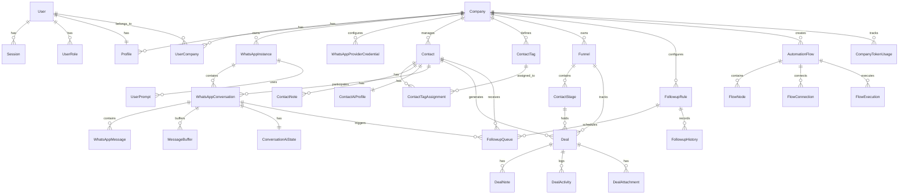
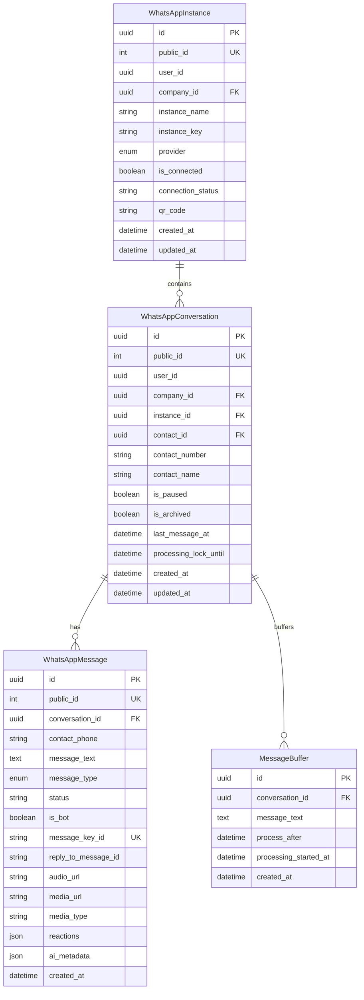

# 3. Modelo de Dados

**Versão:** 1.0.0
**Última Atualização:** 2026-01-21

← [Voltar para SPEC](README.md)

---

## 3.1 Diagrama Entidade-Relacionamento



### Diagrama Detalhado - Auth & Multi-Tenancy

```mermaid
erDiagram
    User {
        uuid id PK
        int public_id UK
        string email UK
        string password_hash
        datetime created_at
        datetime updated_at
    }

    Session {
        uuid id PK
        uuid user_id FK
        string token UK
        datetime expires_at
        string user_agent
        string ip_address
        datetime created_at
    }

    UserRole {
        uuid id PK
        uuid user_id FK
        enum role
        datetime created_at
    }

    Profile {
        uuid id PK
        uuid user_id FK_UK
        uuid company_id FK
        string full_name
        string phone
        string timezone
        string referral_code
        boolean is_active
        datetime created_at
        datetime updated_at
    }

    Company {
        uuid id PK
        int public_id UK
        string name
        boolean is_active
        int max_whatsapp_instances
        string custom_ai_token
        int total_tokens_used
        decimal total_cost_usd
        datetime trial_expires_at
        string own_referral_code UK
        int max_users
        json features
        string plan_type
        datetime created_at
        datetime updated_at
    }

    UserCompany {
        uuid id PK
        uuid user_id FK
        uuid company_id FK
        string role
        json permissions
        datetime created_at
    }

    User ||--o{ Session : has
    User ||--o{ UserRole : has
    User ||--|| Profile : has
    User ||--o{ UserCompany : belongs_to
    Company ||--o{ UserCompany : has
    Company ||--o{ Profile : employs
```

### Diagrama Detalhado - WhatsApp



### Diagrama Detalhado - CRM

```mermaid
erDiagram
    Contact {
        uuid id PK
        int public_id UK
        uuid user_id
        uuid company_id FK
        string phone
        string name
        string first_name
        string last_name
        string email
        string avatar_url
        string company
        string role
        text bio
        string location
        string city
        string country
        text notes
        boolean is_blocked
        datetime last_activity_at
        uuid funnel_id FK
        uuid stage_id FK
        decimal deal_value
        datetime stage_entered_at
        datetime created_at
        datetime updated_at
    }

    ContactTag {
        uuid id PK
        int public_id UK
        uuid user_id
        uuid company_id FK
        string name
        string color
        boolean is_ai_managed
        json ai_trigger_config
        datetime created_at
    }

    ContactTagAssignment {
        uuid contact_id PK_FK
        uuid tag_id PK_FK
        datetime created_at
    }

    ContactNote {
        uuid id PK
        uuid contact_id FK
        uuid user_id
        text content
        datetime created_at
    }

    ContactAiProfile {
        uuid id PK
        uuid contact_id FK_UK
        json preferences
        string[] interests
        string communication_style
        json purchase_history
        string[] key_facts
        datetime last_updated_at
    }

    Contact ||--o{ ContactTagAssignment : has
    ContactTag ||--o{ ContactTagAssignment : assigned
    Contact ||--o{ ContactNote : has
    Contact ||--|| ContactAiProfile : has
```

### Diagrama Detalhado - Deals & Funnels

```mermaid
erDiagram
    Funnel {
        uuid id PK
        int public_id UK
        uuid user_id
        uuid company_id FK
        string name
        string description
        string color
        string icon
        int position
        boolean is_active
        boolean is_default
        datetime created_at
        datetime updated_at
    }

    ContactStage {
        uuid id PK
        int public_id UK
        uuid user_id
        uuid funnel_id FK
        string name
        string meaning (deprecated)
        string description (optional)
        string color
        int position
        float probability
        int wip_limit
        boolean is_won_stage
        boolean is_lost_stage
        boolean is_active
        datetime created_at
        datetime updated_at
    }

    Deal {
        uuid id PK
        int public_id UK
        uuid user_id
        uuid company_id FK
        uuid funnel_id FK
        uuid stage_id FK
        uuid contact_id FK
        uuid cloned_from_deal_id FK
        string title
        string company_name
        decimal value
        string currency
        datetime expected_close_date
        enum status
        string loss_reason
        string priority
        datetime last_activity_at
        datetime stage_entered_at
        datetime created_at
        datetime updated_at
    }

    DealNote {
        uuid id PK
        uuid deal_id FK
        uuid user_id
        string title
        text content
        text content_html
        datetime created_at
        datetime updated_at
    }

    DealActivity {
        uuid id PK
        uuid deal_id FK
        uuid user_id
        string type
        json payload
        datetime created_at
    }

    DealAttachment {
        uuid id PK
        uuid deal_id FK
        uuid user_id
        string file_name
        string file_url
        string file_key
        string storage_provider
        int file_size
        string mime_type
        datetime created_at
    }

    Funnel ||--o{ ContactStage : contains
    Funnel ||--o{ Deal : tracks
    ContactStage ||--o{ Deal : holds
    Deal ||--o{ DealNote : has
    Deal ||--o{ DealActivity : logs
    Deal ||--o{ DealAttachment : has
```

---

## 3.2 Schemas das Tabelas

### Tabela: users

```sql
CREATE TABLE users (
    id UUID PRIMARY KEY DEFAULT gen_random_uuid(),
    public_id SERIAL UNIQUE NOT NULL,
    email VARCHAR(255) NOT NULL UNIQUE,
    password_hash VARCHAR(255) NOT NULL,
    created_at TIMESTAMP NOT NULL DEFAULT NOW(),
    updated_at TIMESTAMP NOT NULL DEFAULT NOW()
);

-- Índices
CREATE INDEX idx_users_email ON users(email);
```

### Tabela: sessions

```sql
CREATE TABLE sessions (
    id UUID PRIMARY KEY DEFAULT gen_random_uuid(),
    user_id UUID NOT NULL REFERENCES users(id) ON DELETE CASCADE,
    token VARCHAR(255) NOT NULL UNIQUE,
    expires_at TIMESTAMP NOT NULL,
    user_agent VARCHAR(500),
    ip_address VARCHAR(45),
    created_at TIMESTAMP NOT NULL DEFAULT NOW()
);

-- Índices
CREATE INDEX idx_sessions_user_id ON sessions(user_id);
CREATE INDEX idx_sessions_expires_at ON sessions(expires_at);
```

### Tabela: companies

```sql
CREATE TABLE companies (
    id UUID PRIMARY KEY DEFAULT gen_random_uuid(),
    public_id SERIAL UNIQUE NOT NULL,
    name VARCHAR(255) NOT NULL,
    is_active BOOLEAN DEFAULT true,
    max_whatsapp_instances INT DEFAULT 1,
    custom_ai_token VARCHAR(255),
    total_tokens_used INT DEFAULT 0,
    total_cost_usd DECIMAL(10, 6) DEFAULT 0,
    last_token_reset_at TIMESTAMP,
    trial_expires_at TIMESTAMP,
    own_referral_code VARCHAR(50) UNIQUE,
    referral_code VARCHAR(50),
    max_users INT DEFAULT 5,
    features JSONB,
    plan_type VARCHAR(50),
    created_at TIMESTAMP NOT NULL DEFAULT NOW(),
    updated_at TIMESTAMP NOT NULL DEFAULT NOW()
);
```

### Tabela: user_companies

```sql
CREATE TABLE user_companies (
    id UUID PRIMARY KEY DEFAULT gen_random_uuid(),
    user_id UUID NOT NULL REFERENCES users(id) ON DELETE CASCADE,
    company_id UUID NOT NULL REFERENCES companies(id) ON DELETE CASCADE,
    role VARCHAR(20) DEFAULT 'member',
    permissions JSONB,
    created_at TIMESTAMP NOT NULL DEFAULT NOW(),

    UNIQUE(user_id, company_id)
);

-- Índices
CREATE INDEX idx_user_companies_user_id ON user_companies(user_id);
CREATE INDEX idx_user_companies_company_id ON user_companies(company_id);
```

### Tabela: whatsapp_conversations

```sql
CREATE TABLE whatsapp_conversations (
    id UUID PRIMARY KEY DEFAULT gen_random_uuid(),
    public_id SERIAL UNIQUE NOT NULL,
    user_id VARCHAR(255) NOT NULL,
    company_id UUID REFERENCES companies(id),
    instance_id UUID REFERENCES user_whatsapp_instances(id),
    contact_id UUID REFERENCES contacts(id) ON DELETE SET NULL,
    contact_number VARCHAR(20) NOT NULL,
    contact_name VARCHAR(255),
    is_paused BOOLEAN DEFAULT false,
    is_archived BOOLEAN DEFAULT false,
    last_message_at TIMESTAMP,
    processing_lock_until TIMESTAMP,
    created_at TIMESTAMP NOT NULL DEFAULT NOW(),
    updated_at TIMESTAMP NOT NULL DEFAULT NOW(),

    UNIQUE(user_id, contact_number)
);

-- Índices
CREATE INDEX idx_whatsapp_conversations_company_id ON whatsapp_conversations(company_id);
CREATE INDEX idx_whatsapp_conversations_user_id ON whatsapp_conversations(user_id);
CREATE INDEX idx_whatsapp_conversations_last_message_at ON whatsapp_conversations(last_message_at);
```

### Tabela: whatsapp_messages

```sql
CREATE TABLE whatsapp_messages (
    id UUID PRIMARY KEY DEFAULT gen_random_uuid(),
    public_id SERIAL UNIQUE NOT NULL,
    conversation_id UUID REFERENCES whatsapp_conversations(id) ON DELETE SET NULL,
    contact_phone VARCHAR(20) NOT NULL,
    message_text TEXT NOT NULL,
    message_type VARCHAR(20) NOT NULL CHECK (message_type IN ('RECEIVED', 'SENT')),
    status VARCHAR(20) DEFAULT 'RECEIVED',
    is_bot BOOLEAN DEFAULT false,
    message_key_id VARCHAR(255) UNIQUE,
    reply_to_message_id VARCHAR(255),
    reply_to_message_text TEXT,
    audio_url TEXT,
    audio_mime_type VARCHAR(100),
    audio_duration_seconds INT,
    audio_key VARCHAR(255),
    audio_provider VARCHAR(50),
    media_url TEXT,
    media_mime_type VARCHAR(100),
    media_type VARCHAR(50),
    media_file_name VARCHAR(255),
    media_key VARCHAR(255),
    media_provider VARCHAR(50),
    reactions JSONB,
    ai_metadata JSONB,
    created_at TIMESTAMP NOT NULL DEFAULT NOW()
);

-- Índices
CREATE INDEX idx_whatsapp_messages_contact_phone ON whatsapp_messages(contact_phone);
CREATE INDEX idx_whatsapp_messages_conversation_id ON whatsapp_messages(conversation_id);
CREATE INDEX idx_whatsapp_messages_created_at ON whatsapp_messages(created_at);
```

### Tabela: contacts

```sql
CREATE TABLE contacts (
    id UUID PRIMARY KEY DEFAULT gen_random_uuid(),
    public_id SERIAL UNIQUE NOT NULL,
    user_id VARCHAR(255) NOT NULL,
    company_id UUID REFERENCES companies(id),
    phone VARCHAR(20) NOT NULL,
    name VARCHAR(255),
    first_name VARCHAR(100),
    last_name VARCHAR(100),
    email VARCHAR(255),
    avatar_url TEXT,
    company VARCHAR(255),
    role VARCHAR(100),
    bio TEXT,
    location VARCHAR(255),
    city VARCHAR(100),
    country VARCHAR(100),
    notes TEXT,
    is_blocked BOOLEAN DEFAULT false,
    last_activity_at TIMESTAMP,
    linkedin_url TEXT,
    instagram_url TEXT,
    facebook_url TEXT,
    twitter_url TEXT,
    github_url TEXT,
    funnel_id UUID REFERENCES funnels(id),
    stage_id UUID REFERENCES contact_stages(id),
    deal_value DECIMAL(12, 2),
    last_interaction_at TIMESTAMP,
    stage_entered_at TIMESTAMP,
    created_at TIMESTAMP NOT NULL DEFAULT NOW(),
    updated_at TIMESTAMP NOT NULL DEFAULT NOW(),

    UNIQUE(user_id, phone)
);

-- Índices
CREATE INDEX idx_contacts_company_id ON contacts(company_id);
CREATE INDEX idx_contacts_user_id ON contacts(user_id);
CREATE INDEX idx_contacts_funnel_id ON contacts(funnel_id);
CREATE INDEX idx_contacts_stage_id ON contacts(stage_id);
CREATE INDEX idx_contacts_company_email ON contacts(company_id, email);
CREATE INDEX idx_contacts_company_phone ON contacts(company_id, phone);
CREATE INDEX idx_contacts_company_name ON contacts(company_id, name);
```

### Tabela: deals

```sql
CREATE TABLE deals (
    id UUID PRIMARY KEY DEFAULT gen_random_uuid(),
    public_id SERIAL UNIQUE NOT NULL,
    user_id VARCHAR(255) NOT NULL,
    company_id UUID REFERENCES companies(id),
    funnel_id UUID NOT NULL REFERENCES funnels(id),
    stage_id UUID NOT NULL REFERENCES contact_stages(id),
    contact_id UUID REFERENCES contacts(id),
    title VARCHAR(255) NOT NULL,
    company_name VARCHAR(255),
    value DECIMAL(12, 2),
    currency VARCHAR(3) DEFAULT 'BRL',
    expected_close_date DATE,
    status VARCHAR(20) DEFAULT 'OPEN' CHECK (status IN ('OPEN', 'WON', 'LOST')),
    priority VARCHAR(20),
    last_activity_at TIMESTAMP,
    stage_entered_at TIMESTAMP,
    created_at TIMESTAMP NOT NULL DEFAULT NOW(),
    updated_at TIMESTAMP NOT NULL DEFAULT NOW()
);

-- Índices
CREATE INDEX idx_deals_company_id ON deals(company_id);
CREATE INDEX idx_deals_funnel_id ON deals(funnel_id);
CREATE INDEX idx_deals_stage_id ON deals(stage_id);
CREATE INDEX idx_deals_contact_id ON deals(contact_id);
CREATE INDEX idx_deals_user_id ON deals(user_id);
```

### Tabela: followup_rules

```sql
CREATE TABLE followup_rules (
    id UUID PRIMARY KEY DEFAULT gen_random_uuid(),
    user_id VARCHAR(255) NOT NULL,
    company_id UUID REFERENCES companies(id),
    instance_id UUID REFERENCES user_whatsapp_instances(id),
    name VARCHAR(255) NOT NULL,
    description TEXT,
    trigger_type VARCHAR(50) NOT NULL,
    trigger_config JSONB NOT NULL,
    action_type VARCHAR(20) DEFAULT 'AI_GENERATED',
    action_template TEXT,
    action_prompt_id VARCHAR(255),
    action_config JSONB,
    conditions JSONB,
    post_actions JSONB,
    max_followups_per_contact INT DEFAULT 3,
    min_interval_hours INT DEFAULT 24,
    min_hours_since_response INT,
    respect_business_hours BOOLEAN DEFAULT true,
    business_hours_start VARCHAR(5),
    business_hours_end VARCHAR(5),
    allowed_days TEXT[],
    ai_validation_enabled BOOLEAN DEFAULT false,
    ai_validation_prompt TEXT,
    priority INT DEFAULT 0,
    is_active BOOLEAN DEFAULT true,
    created_at TIMESTAMP NOT NULL DEFAULT NOW(),
    updated_at TIMESTAMP NOT NULL DEFAULT NOW()
);

-- Índices
CREATE INDEX idx_followup_rules_company_id ON followup_rules(company_id);
CREATE INDEX idx_followup_rules_user_id ON followup_rules(user_id);
```

### Tabela: automation_flows

```sql
CREATE TABLE automation_flows (
    id UUID PRIMARY KEY DEFAULT gen_random_uuid(),
    public_id SERIAL UNIQUE NOT NULL,
    user_id VARCHAR(255),
    company_id UUID REFERENCES companies(id),
    name VARCHAR(255) NOT NULL,
    description TEXT,
    trigger_type VARCHAR(50) NOT NULL,
    trigger_config JSONB,
    is_active BOOLEAN DEFAULT true,
    created_at TIMESTAMP NOT NULL DEFAULT NOW(),
    updated_at TIMESTAMP NOT NULL DEFAULT NOW()
);

-- Índices
CREATE INDEX idx_automation_flows_user_id ON automation_flows(user_id);
CREATE INDEX idx_automation_flows_company_id ON automation_flows(company_id);
```

---

## 3.3 Tipos Enumerados

```sql
-- Roles de aplicação
CREATE TYPE app_role AS ENUM (
    'SUPER_ADMIN',
    'USER'
);

-- Tipo de negócio
CREATE TYPE business_type AS ENUM (
    'PRODUCT',
    'SERVICE',
    'BOTH'
);

-- Provedor de WhatsApp
CREATE TYPE whatsapp_provider AS ENUM (
    'EVOLUTION',
    'UAZAPI'
);

-- Tipo de mensagem
CREATE TYPE message_type AS ENUM (
    'RECEIVED',
    'SENT'
);

-- Tipo de trigger de follow-up
CREATE TYPE followup_trigger_type AS ENUM (
    'NO_RESPONSE',
    'TAG_ADDED',
    'STAGE_CHANGED',
    'SENTIMENT_DETECTED'
);

-- Tipo de ação de follow-up
CREATE TYPE followup_action_type AS ENUM (
    'AI_GENERATED',
    'TEMPLATE'
);

-- Status de follow-up
CREATE TYPE followup_status AS ENUM (
    'PENDING',
    'SENT',
    'RESPONDED',
    'FAILED',
    'CANCELLED'
);

-- Status de deal
CREATE TYPE deal_status AS ENUM (
    'OPEN',
    'WON',
    'LOST'
);
```

---

## 3.4 Relacionamentos

| Tabela Origem | Tabela Destino | Tipo | Descrição |
|---------------|----------------|------|-----------|
| users | sessions | 1:N | Usuário pode ter múltiplas sessões ativas |
| users | user_roles | 1:N | Usuário pode ter múltiplos papéis |
| users | profiles | 1:1 | Usuário tem um perfil |
| users | user_companies | 1:N | Usuário pertence a múltiplas empresas |
| companies | user_companies | 1:N | Empresa tem múltiplos usuários |
| companies | whatsapp_instances | 1:N | Empresa pode ter múltiplas instâncias WhatsApp |
| companies | contacts | 1:N | Empresa gerencia múltiplos contatos |
| companies | funnels | 1:N | Empresa possui múltiplos funis |
| companies | deals | 1:N | Empresa rastreia múltiplos deals |
| companies | followup_rules | 1:N | Empresa configura múltiplas regras de follow-up |
| companies | automation_flows | 1:N | Empresa cria múltiplos fluxos de automação |
| whatsapp_instances | whatsapp_conversations | 1:N | Instância contém múltiplas conversas |
| whatsapp_conversations | whatsapp_messages | 1:N | Conversa contém múltiplas mensagens |
| whatsapp_conversations | conversation_ai_state | 1:1 | Conversa tem um estado de IA |
| contacts | contact_tag_assignments | 1:N | Contato pode ter múltiplas tags |
| contact_tags | contact_tag_assignments | 1:N | Tag pode ser atribuída a múltiplos contatos |
| contacts | contact_notes | 1:N | Contato pode ter múltiplas notas |
| contacts | contact_ai_profiles | 1:1 | Contato tem um perfil de IA |
| contacts | whatsapp_conversations | 1:N | Contato participa de múltiplas conversas |
| contacts | deals | 1:N | Contato pode ter múltiplos deals |
| funnels | contact_stages | 1:N | Funil contém múltiplos estágios |
| funnels | deals | 1:N | Funil rastreia múltiplos deals |
| contact_stages | deals | 1:N | Estágio contém múltiplos deals |
| deals | deal_notes | 1:N | Deal tem múltiplas notas |
| deals | deal_activities | 1:N | Deal registra múltiplas atividades |
| deals | deal_attachments | 1:N | Deal tem múltiplos anexos |
| followup_rules | followup_queue | 1:N | Regra agenda múltiplos follow-ups |
| followup_rules | followup_history | 1:N | Regra registra histórico de follow-ups |
| automation_flows | flow_nodes | 1:N | Fluxo contém múltiplos nós |
| automation_flows | flow_connections | 1:N | Fluxo tem múltiplas conexões |
| automation_flows | flow_executions | 1:N | Fluxo tem múltiplas execuções |

---

## 3.5 Constraints e Validações

### users
- `email`: Único, formato válido de email
- `password_hash`: Mínimo 60 caracteres (bcrypt)
- `public_id`: Auto-incremento, único

### companies
- `name`: 1-255 caracteres
- `max_whatsapp_instances`: >= 1
- `own_referral_code`: Único se presente
- `total_cost_usd`: Precisão de 6 casas decimais

### user_companies
- `role`: Valores permitidos: 'admin', 'coordinator', 'member'
- `(user_id, company_id)`: Combinação única

### whatsapp_conversations
- `contact_number`: 5-20 caracteres, formato válido
- `(user_id, contact_number)`: Combinação única

### whatsapp_messages
- `message_type`: 'RECEIVED' ou 'SENT'
- `status`: 'SENT', 'DELIVERED', 'READ', 'FAILED', 'RECEIVED'
- `message_key_id`: Único se presente

### contacts
- `phone`: 5-20 caracteres, formato válido
- `email`: Formato válido se presente
- `(user_id, phone)`: Combinação única

### contact_tags
- `name`: 1-100 caracteres
- `(company_id, name)`: Combinação única

### deals
- `status`: 'OPEN', 'WON', 'LOST'
- `currency`: Código ISO 4217 de 3 caracteres
- `value`: Precisão de 2 casas decimais

### followup_rules
- `trigger_type`: 'NO_RESPONSE', 'TAG_ADDED', 'STAGE_CHANGED', 'SENTIMENT_DETECTED'
- `action_type`: 'AI_GENERATED', 'TEMPLATE'
- `max_followups_per_contact`: >= 1
- `min_interval_hours`: >= 1

---

## 3.6 Índices para Performance

| Tabela | Índice | Tipo | Justificativa |
|--------|--------|------|---------------|
| users | idx_users_email | B-tree | Busca por login/email |
| sessions | idx_sessions_user_id | B-tree | Listagem de sessões por usuário |
| sessions | idx_sessions_expires_at | B-tree | Limpeza de sessões expiradas |
| user_companies | idx_user_companies_user_id | B-tree | Empresas do usuário |
| user_companies | idx_user_companies_company_id | B-tree | Usuários da empresa |
| whatsapp_conversations | idx_wc_company_id | B-tree | Conversas por empresa (multi-tenant) |
| whatsapp_conversations | idx_wc_last_message_at | B-tree | Ordenação por atividade recente |
| whatsapp_messages | idx_wm_conversation_id | B-tree | Mensagens por conversa |
| whatsapp_messages | idx_wm_created_at | B-tree | Ordenação cronológica |
| whatsapp_messages | idx_wm_contact_phone | B-tree | Busca por contato |
| contacts | idx_contacts_company_id | B-tree | Contatos por empresa (multi-tenant) |
| contacts | idx_contacts_funnel_id | B-tree | Contatos por funil |
| contacts | idx_contacts_stage_id | B-tree | Contatos por estágio |
| contacts | idx_contacts_company_email | B-tree | Busca por email na empresa |
| contacts | idx_contacts_company_phone | B-tree | Busca por telefone na empresa |
| contacts | idx_contacts_company_name | B-tree | Busca por nome na empresa |
| contact_tag_assignments | idx_cta_created_at | B-tree | Tags recentes |
| deals | idx_deals_company_id | B-tree | Deals por empresa (multi-tenant) |
| deals | idx_deals_funnel_id | B-tree | Deals por funil |
| deals | idx_deals_stage_id | B-tree | Deals por estágio |
| deals | idx_deals_contact_id | B-tree | Deals por contato |
| followup_queue | idx_fq_status_scheduled | B-tree | Processamento de fila |
| team_notifications | idx_tn_company_read | B-tree | Notificações não lidas |

---

## 3.7 Campos JSONB

### Estrutura de permissions (user_companies)

```json
{
  "canManageUsers": true,
  "canManageWhatsApp": true,
  "canViewReports": true,
  "canManageFlows": false,
  "canManageContacts": true,
  "canManagePrompt": true
}
```

### Estrutura de features (companies)

```json
{
  "maxContacts": 10000,
  "maxDeals": 1000,
  "aiEnabled": true,
  "customBranding": false,
  "apiAccess": true,
  "advancedAnalytics": false
}
```

### Estrutura de ai_metadata (whatsapp_messages)

```json
{
  "actions_performed": [
    {
      "type": "TAG_ADDED",
      "tag_id": "uuid",
      "tag_name": "Interessado"
    },
    {
      "type": "STAGE_CHANGED",
      "from_stage": "Lead",
      "to_stage": "Qualificado"
    }
  ],
  "sentiment_detected": "positive",
  "intent": "purchase_interest",
  "confidence_score": 0.85
}
```

### Estrutura de trigger_config (followup_rules)

```json
{
  "delay_hours": 24,
  "only_if_no_response": true,
  "exclude_tags": ["VIP", "Não Perturbe"],
  "include_stages": ["Lead", "Qualificado"],
  "sentiment_threshold": 0.5
}
```

### Estrutura de action_config (followup_rules)

```json
{
  "use_conversation_context": true,
  "max_tokens": 200,
  "tone": "friendly",
  "include_greeting": true,
  "custom_instructions": "Mencione a promoção atual"
}
```

### Estrutura de variables (automation_flows)

```json
{
  "contact_name": "{{contact.name}}",
  "last_purchase_date": "{{contact.lastPurchase}}",
  "deal_value": "{{deal.value}}",
  "custom_field_1": "valor personalizado"
}
```

### Estrutura de execution_path (flow_executions)

```json
{
  "steps": [
    {
      "node_id": "uuid-1",
      "executed_at": "2026-01-19T10:00:00Z",
      "result": "success"
    },
    {
      "node_id": "uuid-2",
      "executed_at": "2026-01-19T10:00:01Z",
      "result": "success"
    }
  ],
  "total_duration_ms": 1500
}
```

---

## 3.8 Extensões PostgreSQL

### pgvector

Usado para armazenar embeddings de mensagens para busca semântica:

```sql
-- Habilitar extensão
CREATE EXTENSION IF NOT EXISTS vector;

-- Adicionar coluna de embedding (se necessário)
ALTER TABLE whatsapp_messages
ADD COLUMN embedding vector(1536);

-- Índice para busca de similaridade
CREATE INDEX idx_messages_embedding ON whatsapp_messages
USING ivfflat (embedding vector_cosine_ops)
WITH (lists = 100);

-- Busca semântica
SELECT id, message_text
FROM whatsapp_messages
WHERE embedding IS NOT NULL
ORDER BY embedding <=> '[query_vector]'
LIMIT 10;
```

---

## 3.9 Migrations (Prisma)

### Modelo Prisma - User

```prisma
model User {
  id           String   @id @default(uuid())
  publicId     Int      @unique @default(autoincrement()) @map("public_id")
  email        String   @unique
  passwordHash String   @map("password_hash")
  createdAt    DateTime @default(now()) @map("created_at")
  updatedAt    DateTime @updatedAt @map("updated_at")

  profile       Profile?
  roles         UserRole[]
  sessions      Session[]
  userCompanies UserCompany[]
  apiKeys       ApiKey[]
  quickReplies  QuickReply[]

  @@map("users")
}
```

### Modelo Prisma - Company

```prisma
model Company {
  id                   String    @id @default(uuid())
  publicId             Int       @unique @default(autoincrement()) @map("public_id")
  name                 String
  isActive             Boolean   @default(true) @map("is_active")
  maxWhatsappInstances Int       @default(1) @map("max_whatsapp_instances")
  customAiToken        String?   @map("custom_ai_token")
  totalTokensUsed      Int       @default(0) @map("total_tokens_used")
  totalCostUsd         Decimal   @default(0) @map("total_cost_usd") @db.Decimal(10, 6)
  lastTokenResetAt     DateTime? @map("last_token_reset_at")
  trialExpiresAt       DateTime? @map("trial_expires_at")
  ownReferralCode      String?   @unique @map("own_referral_code")
  referralCode         String?   @map("referral_code")
  maxUsers             Int       @default(5) @map("max_users")
  features             Json?     @map("features")
  planType             String?   @map("plan_type")
  createdAt            DateTime  @default(now()) @map("created_at")
  updatedAt            DateTime  @updatedAt @map("updated_at")

  profiles              Profile[]
  tokenUsage            CompanyTokenUsage[]
  providerCredentials   WhatsAppProviderCredential[]
  userCompanies         UserCompany[]
  whatsappInstances     WhatsAppInstance[]
  whatsappConversations WhatsAppConversation[]
  contacts              Contact[]
  contactTags           ContactTag[]
  funnels               Funnel[]
  deals                 Deal[]
  followupRules         FollowupRule[]
  automationFlows       AutomationFlow[]
  assistantConversations AssistantConversation[]
  apiKeys               ApiKey[]
  teamNotifications     TeamNotification[]
  quickReplies          QuickReply[]

  @@map("companies")
}
```

### Comandos de Migration

```bash
# Gerar migration
npx prisma migrate dev --name add_feature_x

# Aplicar migrations em produção
npx prisma migrate deploy

# Reset do banco (desenvolvimento)
npx prisma migrate reset

# Gerar Prisma Client
npx prisma generate
```

---

## 3.10 Soft Delete

O sistema não usa soft delete global. Comportamentos específicos:

| Tabela | Comportamento on Delete |
|--------|------------------------|
| sessions | CASCADE (deletar com usuário) |
| user_roles | CASCADE (deletar com usuário) |
| user_companies | CASCADE (deletar com usuário ou empresa) |
| whatsapp_messages | SET NULL (preservar mensagens, remover referência) |
| contacts | SET NULL em conversas (preservar histórico) |
| deals | CASCADE para notas, atividades e anexos |
| followup_queue | CASCADE (deletar com regra) |

---

← [Voltar para SPEC](README.md) | [Próximo: Contratos de API →](04-contratos-api/README.md)
