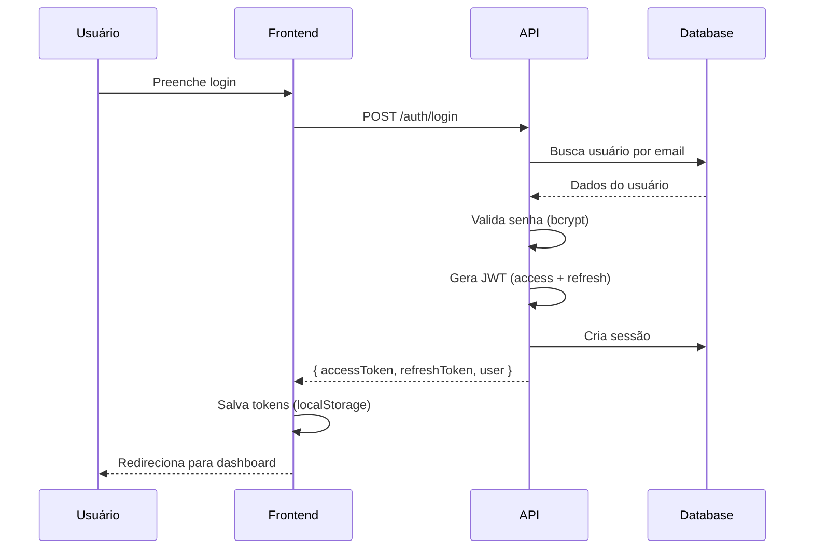
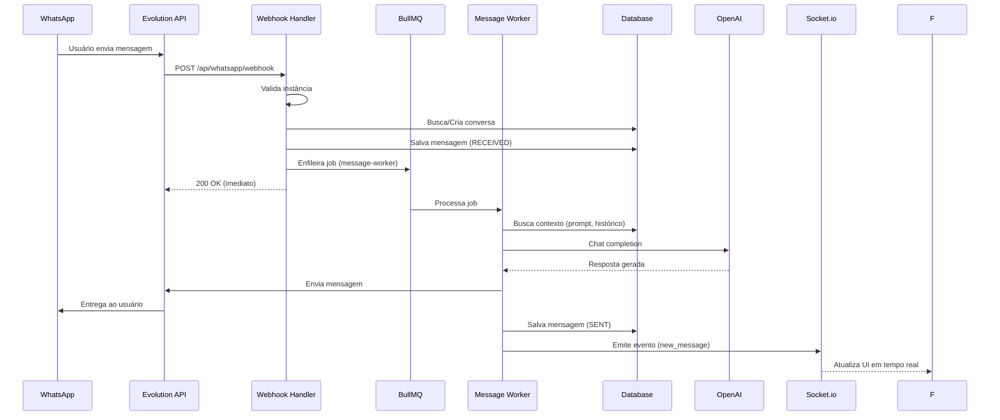
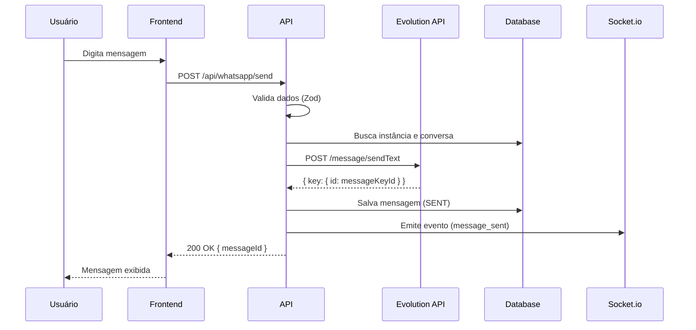
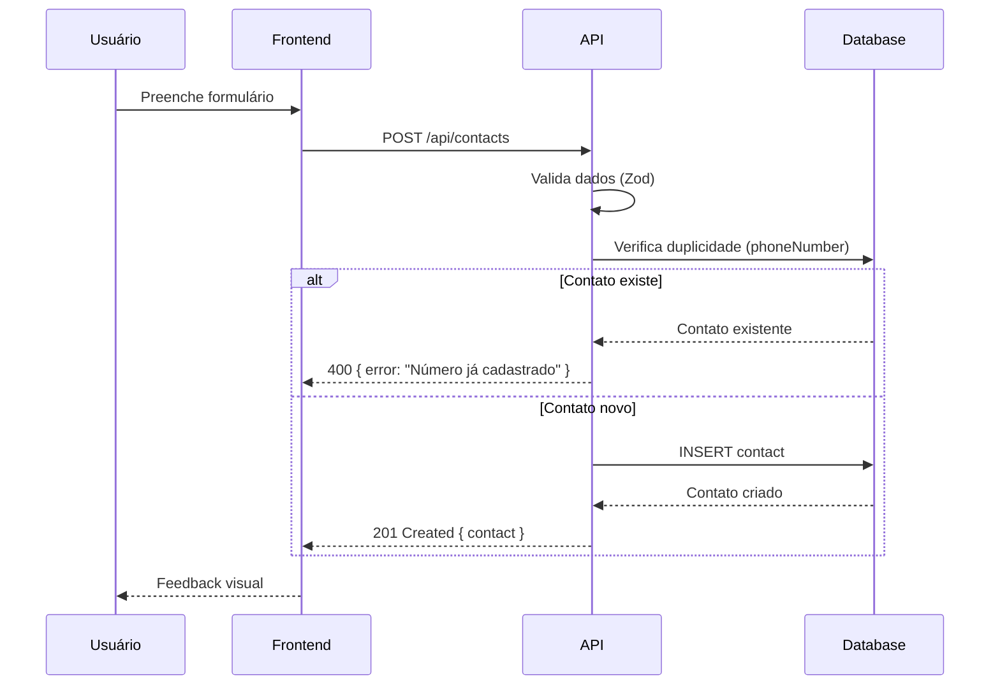
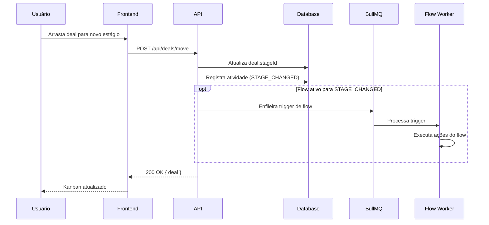
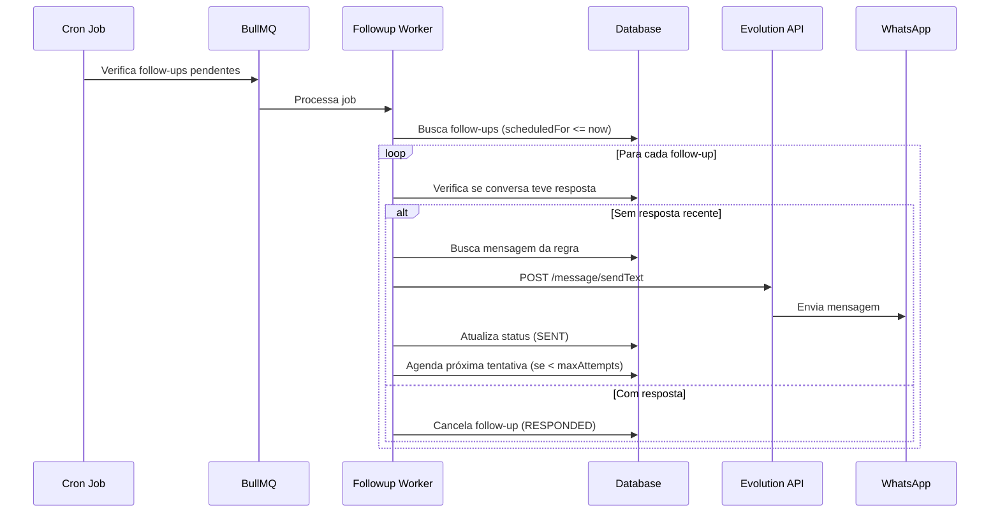
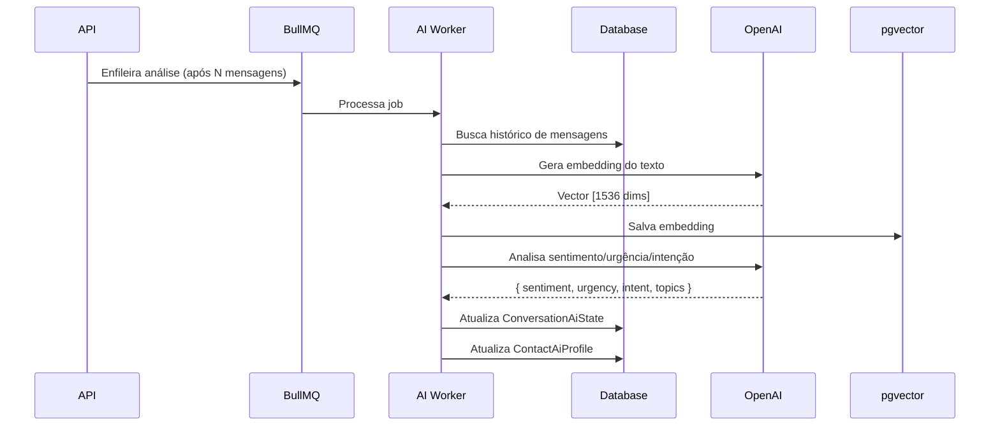
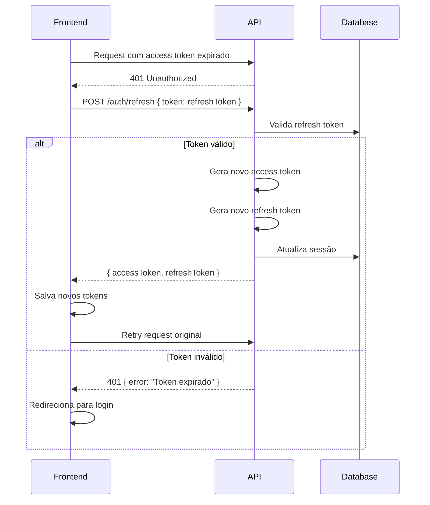
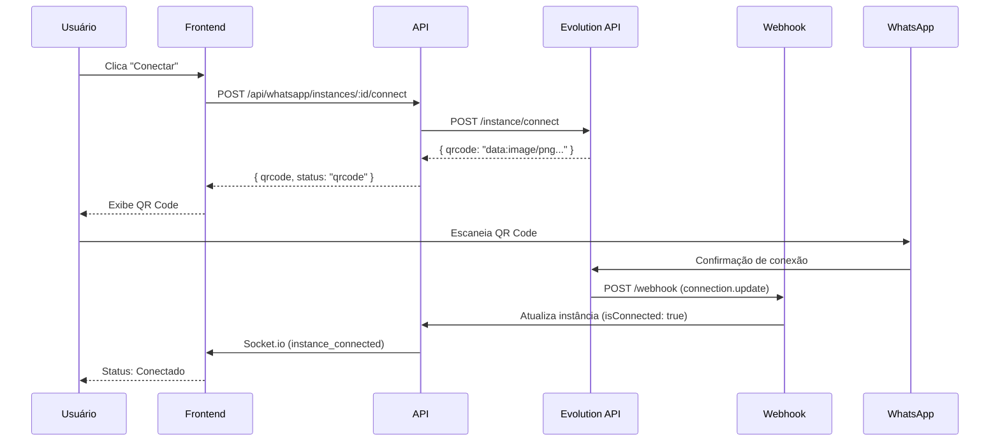
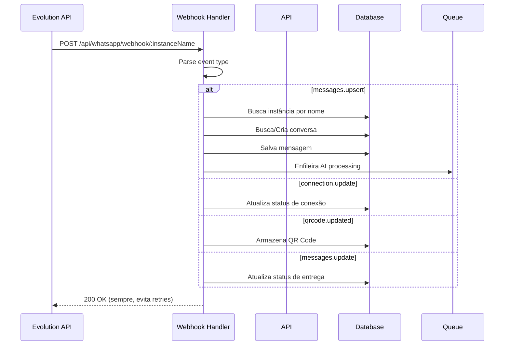

# 5. Diagramas de Sequência

**Versão:** 1.0.0
**Última Atualização:** 2026-01-19

← [Voltar para SPEC](README.md)

---

## 5.1 Fluxo de Autenticação

---

## 5.2 Fluxo de Mensagem WhatsApp (Recebida)

---

## 5.3 Fluxo de Envio de Mensagem (Manual)

---

## 5.4 Fluxo de Criação de Contato

---

## 5.5 Fluxo de Movimentação no Funil

---

## 5.6 Fluxo de Follow-up Automático

---

## 5.7 Fluxo de Análise de IA

---

## 5.8 Fluxo de Refresh Token

---

## 5.9 Fluxo de Conexão WhatsApp (QR Code)

---

## 5.10 Fluxo de Webhook WhatsApp

---

## Como Ler os Diagramas

### Participantes

- **Usuário (U)**: Pessoa usando o sistema
- **Frontend (F)**: React SPA
- **API (A)**: Fastify Backend
- **Database (D)**: PostgreSQL
- **Queue (Q)**: BullMQ/Redis
- **Worker (WK/FW/AW)**: Processadores de jobs
- **Evolution API (E)**: Provedor WhatsApp
- **OpenAI (AI)**: Serviço de IA
- **Socket.io (S)**: WebSocket server
- **WhatsApp (WA)**: Aplicativo do usuário final

### Notações

- `->`: Chamada síncrona
- `-->`: Resposta
- `opt`: Bloco opcional
- `alt/else`: Condicionais
- `loop`: Repetição

---

← [Voltar para SPEC](README.md) | [Próximo: Máquina de Estados →](06-maquina-estados.md)
