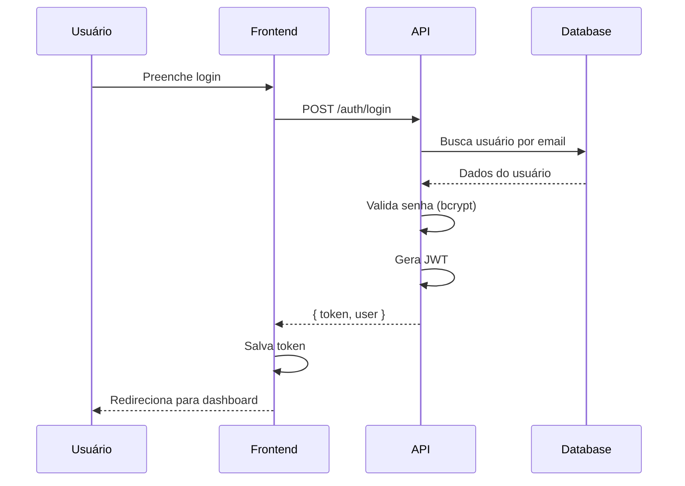
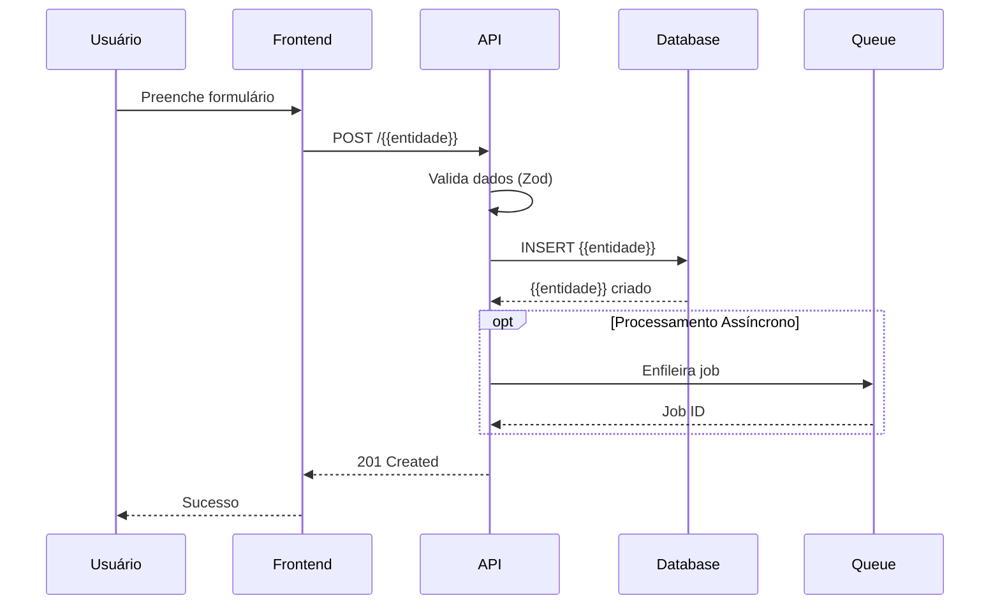
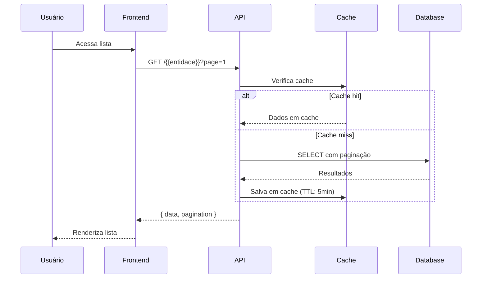
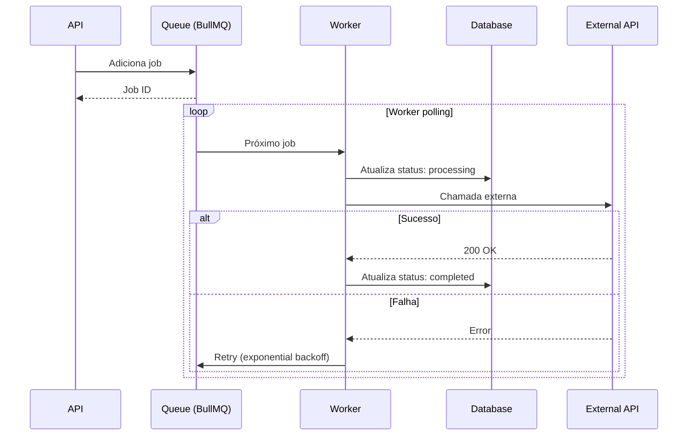
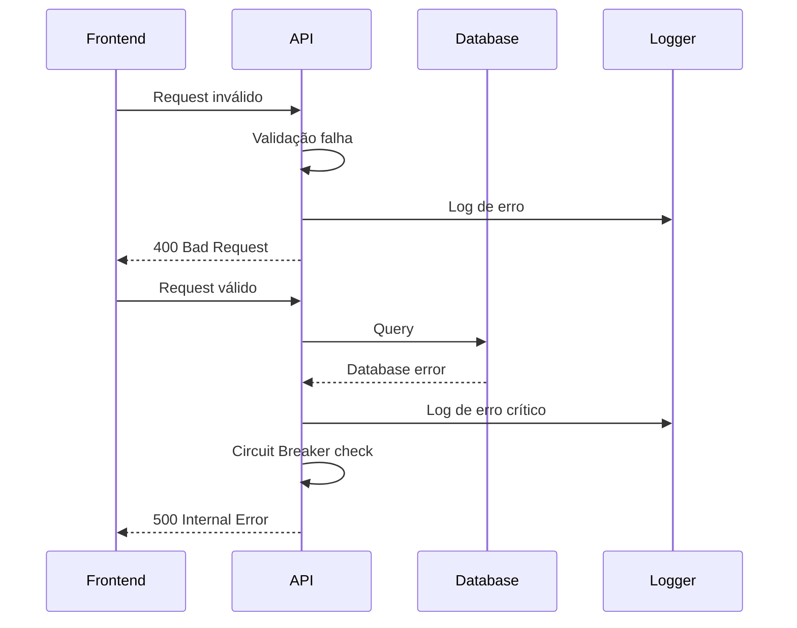
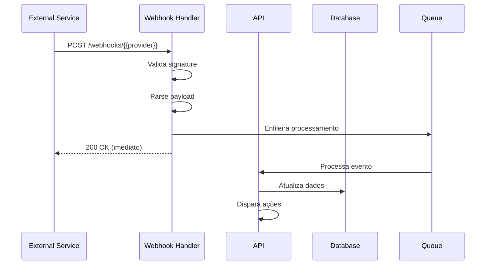

# 5. Diagramas de Sequência

**Versão:** 1.0.0
**Última Atualização:** {{DATA}}

← [Voltar para SPEC](README.md)

---

## 5.1 Fluxo de Autenticação

---

## 5.2 Fluxo de Criação de {{Entidade}}

---

## 5.3 Fluxo de Listagem com Paginação

---

## 5.4 Fluxo de Processamento Assíncrono

---

## 5.5 Fluxo de Tratamento de Erros

---

## 5.6 Fluxo de Webhook/Callback

---

## Como Ler os Diagramas

### Participantes

- **Usuário (U)**: Pessoa usando o sistema
- **Frontend (F)**: Interface web/mobile
- **API (A)**: Backend server
- **Database (D)**: PostgreSQL
- **Queue (Q)**: BullMQ/Redis
- **Worker (W)**: Processador de jobs
- **Cache (C)**: Redis cache
- **External (E)**: APIs de terceiros

### Notações

- `->`: Chamada síncrona
- `-->`: Resposta
- `opt`: Bloco opcional
- `alt/else`: Condicionais
- `loop`: Repetição

---

← [Voltar para SPEC](README.md) | [Próximo: Máquina de Estados →](06-maquina-estados.md)
