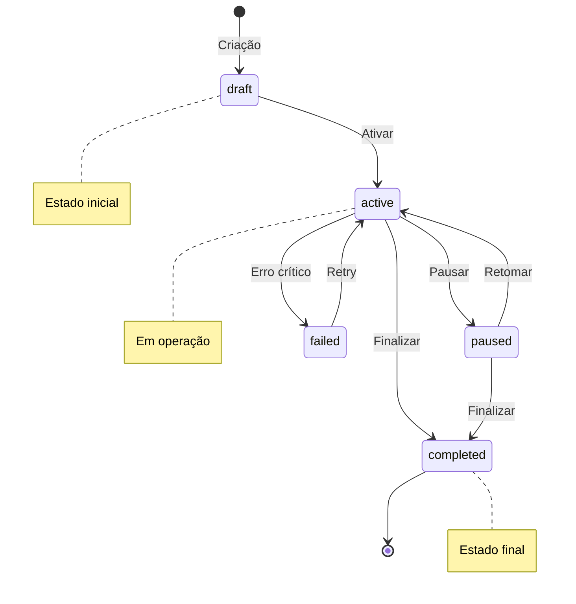

# 6. Máquina de Estados

**Versão:** 1.0.0
**Última Atualização:** {{DATA}}

← [Voltar para SPEC](README.md)

---

## 6.1 Diagrama de Estados - {{Entidade}}



---

## 6.2 Descrição dos Estados

| Estado | Descrição | Ações Permitidas |
|--------|-----------|------------------|
| **draft** | Recém criado, não iniciado | editar, ativar, excluir |
| **active** | Em operação | pausar, editar, finalizar |
| **paused** | Temporariamente suspenso | retomar, editar, finalizar |
| **completed** | Finalizado com sucesso | arquivar, visualizar |
| **failed** | Falhou por erro crítico | retry, investigar |

---

## 6.3 Tabela de Transições

| Estado Atual | Evento | Estado Novo | Condições | Ações |
|--------------|--------|-------------|-----------|-------|
| draft | ACTIVATE | active | Config válida | Iniciar processamento |
| draft | DELETE | (excluído) | - | Soft delete |
| active | PAUSE | paused | - | Pausar jobs |
| active | COMPLETE | completed | Critérios atendidos | Finalizar jobs |
| active | FAIL | failed | Erro crítico | Registrar erro |
| paused | RESUME | active | - | Retomar jobs |
| paused | COMPLETE | completed | - | Finalizar |
| failed | RETRY | active | < max retries | Reset contadores |

---

## 6.4 Eventos e Gatilhos

### Eventos de Sistema

| Evento | Gatilho | Efeito |
|--------|---------|--------|
| `{{entidade}}.created` | POST /{{entidade}} | Cria no estado draft |
| `{{entidade}}.activated` | POST /{{entidade}}/:id/activate | Muda para active |
| `{{entidade}}.paused` | POST /{{entidade}}/:id/pause | Muda para paused |
| `{{entidade}}.completed` | Automático ou manual | Muda para completed |
| `{{entidade}}.failed` | Erro crítico | Muda para failed |

### Eventos de Usuário

| Ação do Usuário | Evento Disparado |
|-----------------|------------------|
| Clica "Ativar" | `{{entidade}}.activated` |
| Clica "Pausar" | `{{entidade}}.paused` |
| Clica "Retomar" | `{{entidade}}.resumed` |
| Clica "Finalizar" | `{{entidade}}.completed` |

---

## 6.5 Estados Finais

| Estado | Tipo | Pode Voltar? | Dados Preservados? |
|--------|------|--------------|-------------------|
| completed | Sucesso | Não | Sim |
| failed | Falha | Sim (retry) | Sim |

---

## 6.6 Implementação

### Enum de Status

```typescript
enum {{Entidade}}Status {
  DRAFT = 'draft',
  ACTIVE = 'active',
  PAUSED = 'paused',
  COMPLETED = 'completed',
  FAILED = 'failed'
}
```

### Transições Válidas

```typescript
const validTransitions: Record<{{Entidade}}Status, {{Entidade}}Status[]> = {
  [{{Entidade}}Status.DRAFT]: [{{Entidade}}Status.ACTIVE],
  [{{Entidade}}Status.ACTIVE]: [
    {{Entidade}}Status.PAUSED,
    {{Entidade}}Status.COMPLETED,
    {{Entidade}}Status.FAILED
  ],
  [{{Entidade}}Status.PAUSED]: [
    {{Entidade}}Status.ACTIVE,
    {{Entidade}}Status.COMPLETED
  ],
  [{{Entidade}}Status.COMPLETED]: [],
  [{{Entidade}}Status.FAILED]: [{{Entidade}}Status.ACTIVE]
};
```

### Função de Transição

```typescript
function transition(
  current: {{Entidade}}Status,
  target: {{Entidade}}Status
): boolean {
  const allowed = validTransitions[current];
  if (!allowed.includes(target)) {
    throw new InvalidTransitionError(current, target);
  }
  return true;
}
```

---

## 6.7 Auditoria de Transições

Cada transição deve ser registrada:

```sql
CREATE TABLE {{entidade}}_state_history (
  id UUID PRIMARY KEY,
  {{entidade}}_id UUID REFERENCES {{entidade}}(id),
  from_state VARCHAR(20),
  to_state VARCHAR(20),
  triggered_by UUID REFERENCES users(id),
  reason TEXT,
  metadata JSONB,
  created_at TIMESTAMP DEFAULT NOW()
);
```

---

← [Voltar para SPEC](README.md) | [Próximo: Tratamento de Erros →](07-tratamento-erros.md)
