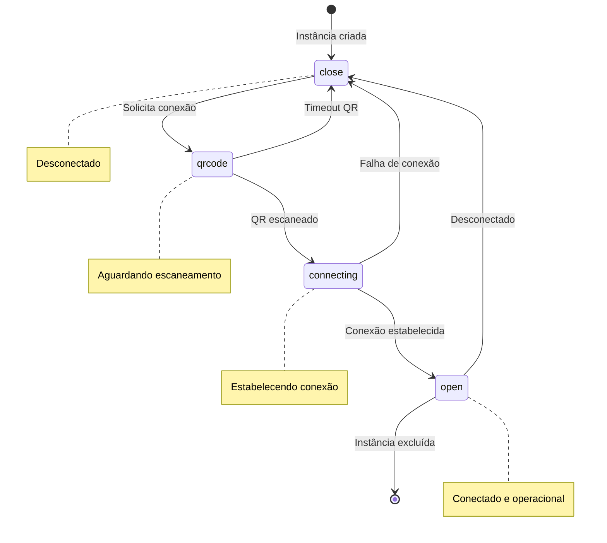
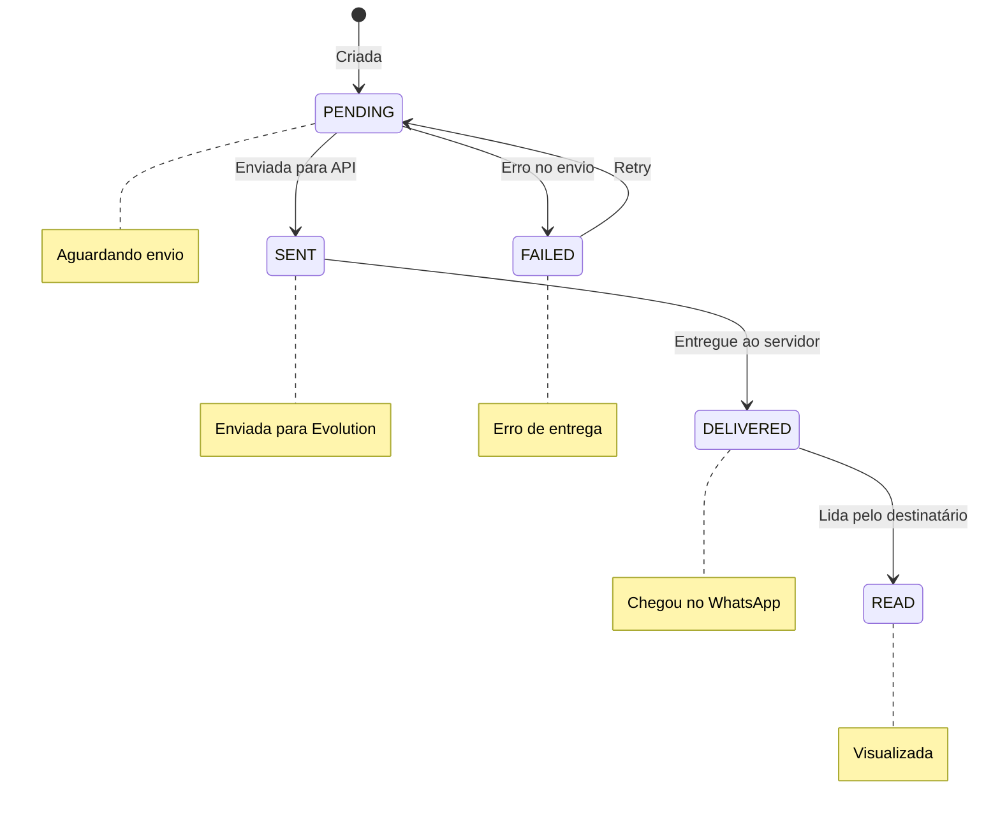
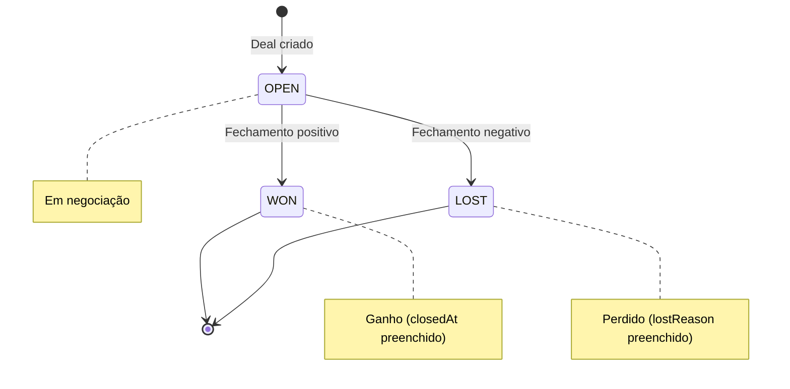
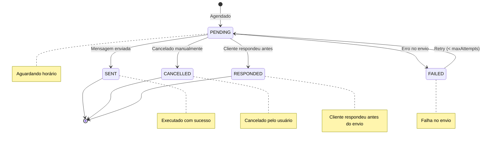
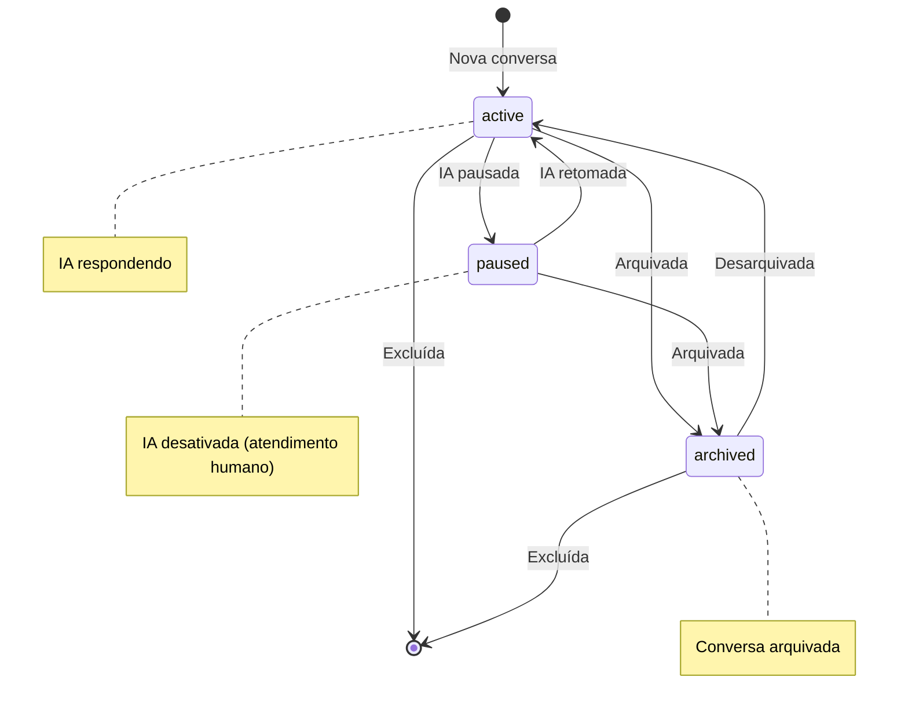
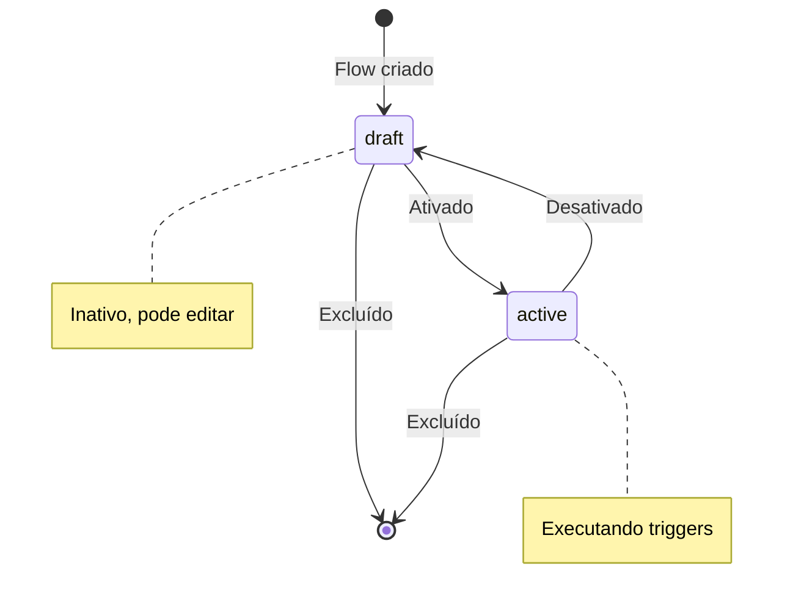
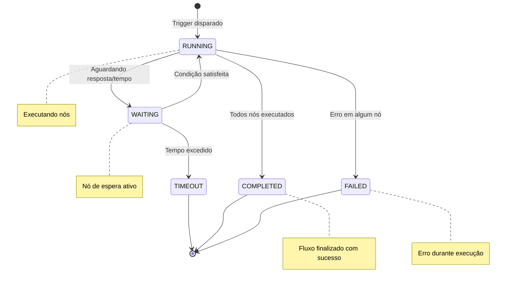

# 6. Máquina de Estados

**Versão:** 1.0.0
**Última Atualização:** 2026-01-19

← [Voltar para SPEC](README.md)

---

## 6.1 Estados de Conexão WhatsApp



### Tabela de Transições - Conexão WhatsApp

| Estado Atual | Evento | Estado Novo | Condições |
|--------------|--------|-------------|-----------|
| close | CONNECT_REQUEST | qrcode | Instância existe |
| qrcode | QR_SCANNED | connecting | QR válido |
| qrcode | QR_TIMEOUT | close | 60s sem scan |
| connecting | CONNECTION_SUCCESS | open | Handshake OK |
| connecting | CONNECTION_FAILED | close | Erro de rede |
| open | DISCONNECTED | close | Usuário deslogou |
| open | DELETE_INSTANCE | (excluído) | - |

---

## 6.2 Estados de Mensagem WhatsApp



### Tabela de Transições - Mensagem

| Estado Atual | Evento | Estado Novo |
|--------------|--------|-------------|
| PENDING | SEND_SUCCESS | SENT |
| PENDING | SEND_FAILED | FAILED |
| SENT | ACK_DELIVERED | DELIVERED |
| DELIVERED | ACK_READ | READ |
| FAILED | RETRY | PENDING |

---

## 6.3 Estados de Deal (Negociação)



### Tabela de Transições - Deal

| Estado Atual | Evento | Estado Novo | Ações |
|--------------|--------|-------------|-------|
| OPEN | MARK_WON | WON | Preenche closedAt |
| OPEN | MARK_LOST | LOST | Preenche closedAt, lostReason |

### Enum de Status - Deal

```typescript
enum DealStatus {
  OPEN = 'OPEN',
  WON = 'WON',
  LOST = 'LOST'
}
```

---

## 6.4 Estados de Follow-up



### Tabela de Transições - Follow-up

| Estado Atual | Evento | Estado Novo | Condições |
|--------------|--------|-------------|-----------|
| PENDING | EXECUTE | SENT | Horário atingido |
| PENDING | CANCEL | CANCELLED | Ação manual |
| PENDING | CUSTOMER_RESPONSE | RESPONDED | Mensagem recebida |
| PENDING | SEND_FAILED | FAILED | Erro de envio |
| FAILED | RETRY | PENDING | attempt < maxAttempts |

### Enum de Status - Follow-up

```typescript
enum FollowupStatus {
  PENDING = 'PENDING',
  SENT = 'SENT',
  FAILED = 'FAILED',
  CANCELLED = 'CANCELLED',
  RESPONDED = 'RESPONDED'
}
```

---

## 6.5 Estados de Conversa WhatsApp



### Tabela de Transições - Conversa

| Estado | isPaused | isArchived | Ações Permitidas |
|--------|----------|------------|------------------|
| active | false | false | Enviar, pausar, arquivar |
| paused | true | false | Enviar, retomar, arquivar |
| archived | any | true | Desarquivar, excluir |

---

## 6.6 Estados de Flow (Automação)



### Tabela de Transições - Flow

| Estado Atual | Evento | Estado Novo |
|--------------|--------|-------------|
| draft | ACTIVATE | active |
| active | DEACTIVATE | draft |
| draft | DELETE | (excluído) |
| active | DELETE | (excluído) |

---

## 6.7 Estados de Execução de Flow



### Enum de Status - Flow Execution

```typescript
enum FlowExecutionStatus {
  RUNNING = 'RUNNING',
  COMPLETED = 'COMPLETED',
  FAILED = 'FAILED',
  WAITING = 'WAITING',
  TIMEOUT = 'TIMEOUT'
}
```

---

## 6.8 Implementação de Transição

### Validador de Transição Genérico

```typescript
type TransitionMap<T extends string> = Record<T, T[]>;

function validateTransition<T extends string>(
  transitions: TransitionMap<T>,
  current: T,
  target: T
): boolean {
  const allowed = transitions[current];
  if (!allowed || !allowed.includes(target)) {
    throw new InvalidTransitionError(
      `Transição inválida: ${current} → ${target}`
    );
  }
  return true;
}
```

### Exemplo: Transições de Deal

```typescript
const dealTransitions: TransitionMap<DealStatus> = {
  [DealStatus.OPEN]: [DealStatus.WON, DealStatus.LOST],
  [DealStatus.WON]: [],
  [DealStatus.LOST]: []
};

// Uso
validateTransition(dealTransitions, DealStatus.OPEN, DealStatus.WON); // OK
validateTransition(dealTransitions, DealStatus.WON, DealStatus.OPEN); // Erro!
```

---

## 6.9 Auditoria de Transições

Todas as transições de estado são registradas para auditoria:

```sql
-- Exemplo: deal_activities
CREATE TABLE deal_activities (
  id UUID PRIMARY KEY DEFAULT gen_random_uuid(),
  deal_id UUID REFERENCES deals(id),
  type VARCHAR(50) NOT NULL,  -- 'STATUS_CHANGED', 'STAGE_CHANGED', etc.
  description TEXT,
  metadata JSONB,  -- { fromStatus, toStatus, fromStage, toStage }
  created_by UUID REFERENCES users(id),
  created_at TIMESTAMP DEFAULT NOW()
);

-- Exemplo: followup_history
CREATE TABLE followup_history (
  id UUID PRIMARY KEY DEFAULT gen_random_uuid(),
  followup_queue_id UUID,
  rule_id UUID REFERENCES followup_rules(id),
  status followup_status NOT NULL,
  scheduled_for TIMESTAMP,
  executed_at TIMESTAMP,
  message_id VARCHAR(100),
  error TEXT,
  created_at TIMESTAMP DEFAULT NOW()
);
```

---

← [Voltar para SPEC](README.md) | [Próximo: Tratamento de Erros →](07-tratamento-erros.md)
