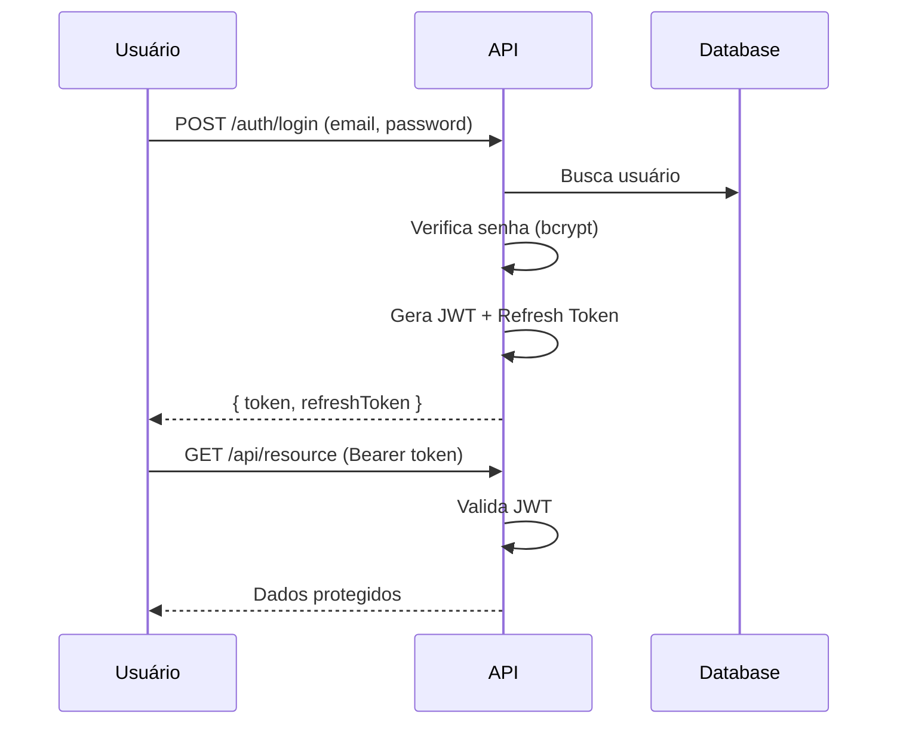

# 11. Segurança

**Versão:** 1.0.0
**Última Atualização:** {{DATA}}

← [Voltar para SPEC](README.md)

---

## 11.1 Autenticação

### JWT (JSON Web Tokens)

```typescript
// Estrutura do token
interface JWTPayload {
  sub: string;        // user_id
  email: string;
  role: string;
  iat: number;        // issued at
  exp: number;        // expiration
}

// Configuração
const jwtConfig = {
  secret: process.env.JWT_SECRET,
  expiresIn: '1d',
  refreshExpiresIn: '7d',
  algorithm: 'HS256'
};
```

### Fluxo de Autenticação



### Refresh Token

- Armazenado no banco com expiração
- Usado para renovar access token
- Invalidado no logout

---

## 11.2 Autorização

### RBAC (Role-Based Access Control)

| Role | Permissões |
|------|------------|
| `admin` | Todas as operações |
| `user` | CRUD próprios recursos |
| `viewer` | Somente leitura |

### Middleware de Autorização

```typescript
function authorize(...allowedRoles: string[]) {
  return (req: Request, res: Response, next: NextFunction) => {
    const user = req.user;

    if (!user) {
      return res.status(401).json({ error: 'unauthorized' });
    }

    if (!allowedRoles.includes(user.role)) {
      return res.status(403).json({ error: 'forbidden' });
    }

    next();
  };
}

// Uso
app.delete('/users/:id', authorize('admin'), deleteUser);
```

---

## 11.3 Proteção contra OWASP Top 10

### 1. Injection

```typescript
// ❌ Vulnerável
const query = `SELECT * FROM users WHERE email = '${email}'`;

// ✅ Seguro - Prepared Statements
const user = await prisma.user.findUnique({ where: { email } });
```

### 2. Broken Authentication

- Senhas com bcrypt (min 12 rounds)
- Rate limiting em endpoints de auth
- Tokens com expiração curta
- Logout invalida tokens

### 3. Sensitive Data Exposure

- HTTPS obrigatório
- Dados sensíveis criptografados
- Nunca logar senhas/tokens
- Sanitizar respostas de API

### 4. XSS (Cross-Site Scripting)

```typescript
// Sanitização de input
import DOMPurify from 'dompurify';

const sanitized = DOMPurify.sanitize(userInput);

// Headers de segurança
app.use(helmet({
  contentSecurityPolicy: {
    directives: {
      defaultSrc: ["'self'"],
      scriptSrc: ["'self'"],
      styleSrc: ["'self'", "'unsafe-inline'"]
    }
  }
}));
```

### 5. CSRF (Cross-Site Request Forgery)

```typescript
import csrf from 'csurf';

// Para aplicações com sessão
app.use(csrf({ cookie: true }));

// Para APIs com JWT - geralmente não necessário
// mas pode usar Double Submit Cookie
```

---

## 11.4 Headers de Segurança

```typescript
import helmet from 'helmet';

app.use(helmet({
  // Previne clickjacking
  frameguard: { action: 'deny' },

  // Previne sniffing de MIME type
  noSniff: true,

  // Força HTTPS
  hsts: {
    maxAge: 31536000,
    includeSubDomains: true
  },

  // Content Security Policy
  contentSecurityPolicy: {
    directives: {
      defaultSrc: ["'self'"],
      scriptSrc: ["'self'"],
      styleSrc: ["'self'", "'unsafe-inline'"],
      imgSrc: ["'self'", 'data:', 'https:'],
      connectSrc: ["'self'", 'https://api.{{domain}}.com']
    }
  }
}));
```

---

## 11.5 Criptografia

### Senhas

```typescript
import bcrypt from 'bcrypt';

const SALT_ROUNDS = 12;

// Hash
const hash = await bcrypt.hash(password, SALT_ROUNDS);

// Verificação
const isValid = await bcrypt.compare(password, hash);
```

### Dados Sensíveis

```typescript
import crypto from 'crypto';

const ALGORITHM = 'aes-256-gcm';
const KEY = Buffer.from(process.env.ENCRYPTION_KEY, 'hex');

function encrypt(text: string): string {
  const iv = crypto.randomBytes(16);
  const cipher = crypto.createCipheriv(ALGORITHM, KEY, iv);
  let encrypted = cipher.update(text, 'utf8', 'hex');
  encrypted += cipher.final('hex');
  const authTag = cipher.getAuthTag();
  return `${iv.toString('hex')}:${authTag.toString('hex')}:${encrypted}`;
}
```

---

## 11.6 Rate Limiting

```typescript
import rateLimit from 'express-rate-limit';

// Global
const globalLimiter = rateLimit({
  windowMs: 60 * 1000, // 1 minuto
  max: 100,
  message: { error: 'rate_limited', message: 'Too many requests' }
});

// Auth endpoints (mais restritivo)
const authLimiter = rateLimit({
  windowMs: 60 * 1000,
  max: 10,
  skipSuccessfulRequests: true
});

app.use('/api/', globalLimiter);
app.use('/auth/', authLimiter);
```

---

## 11.7 Validação de Input

```typescript
import { z } from 'zod';

const createUserSchema = z.object({
  email: z.string().email().max(255),
  password: z.string().min(8).max(100),
  name: z.string().min(2).max(100).regex(/^[a-zA-Z\s]+$/)
});

// Middleware de validação
function validate(schema: z.ZodSchema) {
  return (req: Request, res: Response, next: NextFunction) => {
    const result = schema.safeParse(req.body);
    if (!result.success) {
      return res.status(400).json({
        error: 'validation_error',
        details: result.error.errors
      });
    }
    req.body = result.data;
    next();
  };
}
```

---

## 11.8 Checklist de Segurança

### Autenticação
- [ ] Senhas com bcrypt (≥12 rounds)
- [ ] JWT com expiração curta
- [ ] Refresh tokens implementados
- [ ] Rate limiting em login

### Autorização
- [ ] RBAC implementado
- [ ] Verificação de ownership
- [ ] Endpoints protegidos

### Dados
- [ ] HTTPS obrigatório
- [ ] Dados sensíveis criptografados
- [ ] PII não logado
- [ ] Backups criptografados

### Infraestrutura
- [ ] Headers de segurança
- [ ] CORS configurado
- [ ] Firewall configurado
- [ ] Secrets em vault

---

← [Voltar para SPEC](README.md) | [Próximo: Performance →](12-performance.md)
