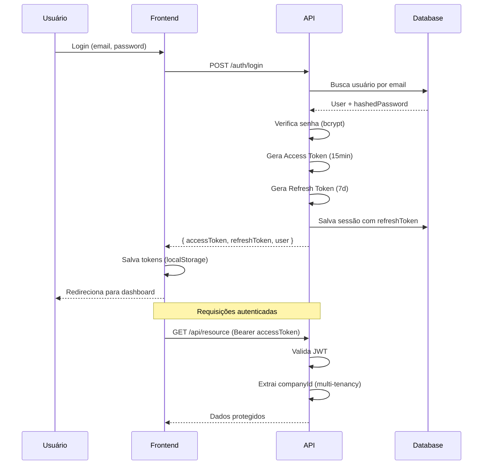

# 11. Segurança

**Versão:** 1.0.0
**Última Atualização:** 2026-01-19

← [Voltar para SPEC](README.md)

---

## 11.1 Autenticação

### JWT (JSON Web Tokens)

```typescript
// Estrutura do Access Token
interface JWTPayload {
  sub: string;        // user_id
  email: string;
  role: string;       // 'admin' | 'user'
  companyId: string;  // Multi-tenancy isolation
  iat: number;        // issued at
  exp: number;        // expiration
}

// Configuração
const jwtConfig = {
  secret: process.env.JWT_SECRET,      // Mínimo 32 caracteres
  expiresIn: '15m',                    // Access token curto
  refreshExpiresIn: '7d',              // Refresh token longo
  algorithm: 'HS256'
};
```

### Fluxo de Autenticação



### Refresh Token

```typescript
// Tabela de sessões
model Session {
  id           String   @id @default(uuid())
  userId       String
  refreshToken String   @unique
  userAgent    String?
  ipAddress    String?
  expiresAt    DateTime
  createdAt    DateTime @default(now())

  user         User     @relation(fields: [userId], references: [id])
}

// Fluxo de refresh
async function refreshAccessToken(refreshToken: string) {
  // Busca sessão válida
  const session = await prisma.session.findUnique({
    where: { refreshToken },
    include: { user: true }
  });

  if (!session || session.expiresAt < new Date()) {
    throw new UnauthorizedError('Sessão expirada');
  }

  // Gera novos tokens
  const newAccessToken = generateAccessToken(session.user);
  const newRefreshToken = generateRefreshToken();

  // Rotaciona refresh token (one-time use)
  await prisma.session.update({
    where: { id: session.id },
    data: {
      refreshToken: newRefreshToken,
      expiresAt: addDays(new Date(), 7)
    }
  });

  return { accessToken: newAccessToken, refreshToken: newRefreshToken };
}
```

---

## 11.2 Autorização

### RBAC (Role-Based Access Control)

| Role | Descrição | Permissões |
|------|-----------|------------|
| `admin` | Administrador da empresa | Todas as operações, gerenciar usuários |
| `user` | Usuário padrão | CRUD próprios recursos, não pode gerenciar usuários |

### Middleware de Autorização

```typescript
// server/src/middleware/auth.ts
import { FastifyRequest, FastifyReply } from 'fastify';
import { verifyToken } from '../lib/jwt';

interface AuthenticatedRequest extends FastifyRequest {
  user: {
    id: string;
    email: string;
    role: string;
    companyId: string;
  };
}

// Autenticação básica
async function authenticate(request: FastifyRequest, reply: FastifyReply) {
  const authHeader = request.headers.authorization;

  if (!authHeader?.startsWith('Bearer ')) {
    return reply.status(401).send({ error: 'Token não fornecido' });
  }

  const token = authHeader.substring(7);

  try {
    const payload = verifyToken(token);
    request.user = payload;
  } catch (error) {
    return reply.status(401).send({ error: 'Token inválido' });
  }
}

// Autorização por role
function authorize(...allowedRoles: string[]) {
  return async (request: AuthenticatedRequest, reply: FastifyReply) => {
    if (!request.user) {
      return reply.status(401).send({ error: 'Não autenticado' });
    }

    if (!allowedRoles.includes(request.user.role)) {
      return reply.status(403).send({ error: 'Sem permissão' });
    }
  };
}

// Uso nas rotas
app.delete('/users/:id',
  { preHandler: [authenticate, authorize('admin')] },
  deleteUser
);
```

### Multi-Tenancy Isolation

```typescript
// Todas as queries devem incluir companyId
async function getContacts(userId: string, companyId: string) {
  return prisma.contact.findMany({
    where: {
      companyId,  // Isolamento por empresa
      // Outros filtros...
    }
  });
}

// Middleware para injetar companyId
app.addHook('preHandler', (request, reply, done) => {
  if (request.user) {
    // Injeta companyId em todas as requisições autenticadas
    request.companyId = request.user.companyId;
  }
  done();
});
```

---

## 11.3 Proteção contra OWASP Top 10

### 1. Injection (SQL, NoSQL, Command)

```typescript
// ❌ Vulnerável - SQL Injection
const query = `SELECT * FROM users WHERE email = '${email}'`;

// ✅ Seguro - Prisma ORM (prepared statements)
const user = await prisma.user.findUnique({
  where: { email }
});

// ✅ Seguro - Validação Zod
const schema = z.object({
  email: z.string().email(),
  password: z.string().min(6)
});
```

### 2. Broken Authentication

```typescript
// Senhas com bcrypt (12 rounds)
import bcrypt from 'bcrypt';
const SALT_ROUNDS = 12;

const hash = await bcrypt.hash(password, SALT_ROUNDS);
const isValid = await bcrypt.compare(password, hash);

// Rate limiting em endpoints de auth
const authLimiter = {
  max: 30,
  timeWindow: '1 minute',
  keyGenerator: (request) => request.ip
};

app.register(fastifyRateLimit, authLimiter);
```

### 3. Sensitive Data Exposure

```typescript
// Nunca retornar senha ou tokens
const userResponse = {
  id: user.id,
  email: user.email,
  name: user.name,
  // ❌ NUNCA: password, refreshToken, apiKeys
};

// Sanitizar logs
const logger = pino({
  redact: [
    'password',
    'refreshToken',
    'apiKey',
    'req.headers.authorization',
    '*.password',
    '*.token'
  ]
});
```

### 4. XSS (Cross-Site Scripting)

```typescript
// React já escapa por padrão
// Mas evitar dangerouslySetInnerHTML

// Sanitização para casos especiais
import DOMPurify from 'dompurify';
const sanitized = DOMPurify.sanitize(userInput);

// Content Security Policy
app.register(fastifyHelmet, {
  contentSecurityPolicy: {
    directives: {
      defaultSrc: ["'self'"],
      scriptSrc: ["'self'"],
      styleSrc: ["'self'", "'unsafe-inline'"],
      imgSrc: ["'self'", 'data:', 'https:'],
      connectSrc: ["'self'", 'https://api.evoaiconnect.com', 'wss://api.evoaiconnect.com']
    }
  }
});
```

### 5. IDOR (Insecure Direct Object Reference)

```typescript
// ❌ Vulnerável - Acesso direto por ID
app.get('/contacts/:id', async (request, reply) => {
  const contact = await prisma.contact.findUnique({
    where: { id: request.params.id }
  });
  return contact; // Pode acessar contato de outra empresa!
});

// ✅ Seguro - Verificação de ownership
app.get('/contacts/:id', async (request, reply) => {
  const contact = await prisma.contact.findFirst({
    where: {
      id: request.params.id,
      companyId: request.user.companyId  // Verifica pertencimento
    }
  });

  if (!contact) {
    return reply.status(404).send({ error: 'Contato não encontrado' });
  }

  return contact;
});
```

### 6. CSRF (Cross-Site Request Forgery)

```typescript
// JWT em Authorization header (não cookie) já protege contra CSRF
// Mas se usar cookies para sessão:

app.register(fastifyCookie);
app.register(fastifyCsrf, {
  sessionPlugin: '@fastify/cookie',
  cookieOpts: {
    signed: true,
    httpOnly: true,
    sameSite: 'strict'
  }
});
```

---

## 11.4 Headers de Segurança

```typescript
import fastifyHelmet from '@fastify/helmet';

app.register(fastifyHelmet, {
  // Previne clickjacking
  frameguard: { action: 'deny' },

  // Previne sniffing de MIME type
  noSniff: true,

  // Força HTTPS
  hsts: {
    maxAge: 31536000,        // 1 ano
    includeSubDomains: true,
    preload: true
  },

  // Previne XSS
  xssFilter: true,

  // Content Security Policy
  contentSecurityPolicy: {
    directives: {
      defaultSrc: ["'self'"],
      scriptSrc: ["'self'"],
      styleSrc: ["'self'", "'unsafe-inline'"],
      imgSrc: ["'self'", 'data:', 'https:', 'blob:'],
      fontSrc: ["'self'", 'https://fonts.gstatic.com'],
      connectSrc: [
        "'self'",
        'https://api.evoaiconnect.com',
        'wss://api.evoaiconnect.com',
        'https://api.openai.com'
      ],
      frameSrc: ["'none'"],
      objectSrc: ["'none'"]
    }
  },

  // Referrer Policy
  referrerPolicy: { policy: 'strict-origin-when-cross-origin' }
});
```

---

## 11.5 Criptografia

### Senhas

```typescript
import bcrypt from 'bcrypt';

const SALT_ROUNDS = 12;  // Custo computacional adequado

// Hash de senha
async function hashPassword(password: string): Promise<string> {
  return bcrypt.hash(password, SALT_ROUNDS);
}

// Verificação
async function verifyPassword(password: string, hash: string): Promise<boolean> {
  return bcrypt.compare(password, hash);
}
```

### Dados Sensíveis (API Keys, Tokens)

```typescript
import crypto from 'crypto';

const ALGORITHM = 'aes-256-gcm';
const KEY = Buffer.from(process.env.ENCRYPTION_KEY, 'hex'); // 32 bytes

function encrypt(text: string): string {
  const iv = crypto.randomBytes(16);
  const cipher = crypto.createCipheriv(ALGORITHM, KEY, iv);

  let encrypted = cipher.update(text, 'utf8', 'hex');
  encrypted += cipher.final('hex');

  const authTag = cipher.getAuthTag();

  return `${iv.toString('hex')}:${authTag.toString('hex')}:${encrypted}`;
}

function decrypt(encryptedData: string): string {
  const [ivHex, authTagHex, encrypted] = encryptedData.split(':');

  const iv = Buffer.from(ivHex, 'hex');
  const authTag = Buffer.from(authTagHex, 'hex');

  const decipher = crypto.createDecipheriv(ALGORITHM, KEY, iv);
  decipher.setAuthTag(authTag);

  let decrypted = decipher.update(encrypted, 'hex', 'utf8');
  decrypted += decipher.final('utf8');

  return decrypted;
}

// Uso para API keys do Evolution/OpenAI
const encryptedApiKey = encrypt(plainApiKey);
// Armazenar encryptedApiKey no banco
```

---

## 11.6 Rate Limiting

```typescript
import fastifyRateLimit from '@fastify/rate-limit';

// Global rate limit
app.register(fastifyRateLimit, {
  global: true,
  max: 100,
  timeWindow: '1 minute',
  keyGenerator: (request) => request.user?.companyId || request.ip,
  errorResponseBuilder: (request, context) => ({
    success: false,
    error: 'Too many requests. Please try again later.',
    retryAfter: Math.ceil(context.ttl / 1000)
  })
});

// Rate limits específicos por endpoint
const rateLimits = {
  auth: { max: 30, timeWindow: '1 minute' },      // Login/Register
  default: { max: 100, timeWindow: '1 minute' },  // API geral
  heavy: { max: 30, timeWindow: '1 minute' },     // AI endpoints
  webhook: { max: 1000, timeWindow: '1 minute' }  // WhatsApp webhooks
};

// Aplicar rate limit específico
app.post('/auth/login', {
  config: { rateLimit: rateLimits.auth }
}, loginHandler);

app.post('/ai/analyze', {
  config: { rateLimit: rateLimits.heavy }
}, analyzeHandler);
```

---

## 11.7 Validação de Input

```typescript
import { z } from 'zod';

// Schemas de validação
const createContactSchema = z.object({
  name: z.string().min(2).max(100),
  phoneNumber: z.string()
    .regex(/^[0-9]{10,15}$/, 'Número de telefone inválido'),
  email: z.string().email().max(255).optional(),
  tags: z.array(z.string().uuid()).optional()
});

const createDealSchema = z.object({
  title: z.string().min(1).max(200),
  value: z.number().min(0).max(999999999),
  stageId: z.string().uuid(),
  contactId: z.string().uuid(),
  expectedCloseDate: z.string().datetime().optional()
});

// Middleware de validação Fastify
function validateBody<T extends z.ZodSchema>(schema: T) {
  return async (request: FastifyRequest, reply: FastifyReply) => {
    const result = schema.safeParse(request.body);

    if (!result.success) {
      return reply.status(400).send({
        success: false,
        error: 'validation_error',
        details: result.error.errors.map(e => ({
          field: e.path.join('.'),
          message: e.message
        }))
      });
    }

    request.body = result.data;
  };
}

// Uso
app.post('/contacts', {
  preHandler: [authenticate, validateBody(createContactSchema)]
}, createContact);
```

---

## 11.8 CORS Configuration

```typescript
import fastifyCors from '@fastify/cors';

app.register(fastifyCors, {
  origin: (origin, cb) => {
    const allowedOrigins = [
      'https://app.evoaiconnect.com',
      'https://staging.evoaiconnect.com',
      process.env.NODE_ENV === 'development' && 'http://localhost:5173'
    ].filter(Boolean);

    if (!origin || allowedOrigins.includes(origin)) {
      cb(null, true);
    } else {
      cb(new Error('Not allowed by CORS'), false);
    }
  },
  credentials: true,
  methods: ['GET', 'POST', 'PUT', 'PATCH', 'DELETE', 'OPTIONS'],
  allowedHeaders: ['Content-Type', 'Authorization', 'X-Request-ID'],
  exposedHeaders: ['X-Request-ID', 'X-RateLimit-Remaining']
});
```

---

## 11.9 Webhook Security

```typescript
// Validação de webhook do Evolution API
async function validateWebhook(request: FastifyRequest, reply: FastifyReply) {
  const signature = request.headers['x-webhook-signature'];
  const body = JSON.stringify(request.body);

  if (!signature) {
    return reply.status(401).send({ error: 'Missing signature' });
  }

  const expectedSignature = crypto
    .createHmac('sha256', process.env.WEBHOOK_SECRET)
    .update(body)
    .digest('hex');

  if (!crypto.timingSafeEqual(
    Buffer.from(signature),
    Buffer.from(expectedSignature)
  )) {
    return reply.status(401).send({ error: 'Invalid signature' });
  }
}

// Validação de instância
async function validateInstance(request: FastifyRequest, reply: FastifyReply) {
  const instanceName = request.params.instanceName;

  const instance = await prisma.whatsAppInstance.findFirst({
    where: { instanceName }
  });

  if (!instance) {
    return reply.status(404).send({ error: 'Instance not found' });
  }

  request.instance = instance;
}

app.post('/whatsapp/webhook/:instanceName', {
  preHandler: [validateWebhook, validateInstance]
}, webhookHandler);
```

---

## 11.10 Secrets Management

### Variáveis de Ambiente

```bash
# Nunca commitar no repositório
# Usar .env.example como template

# Obrigatórias
JWT_SECRET=min-32-chars-random-string
ENCRYPTION_KEY=64-hex-chars-for-aes256
DATABASE_URL=postgresql://...?sslmode=require
REDIS_URL=redis://...

# API Keys (criptografadas no banco)
OPENAI_API_KEY=sk-...
EVOLUTION_API_KEY=...

# Webhook
WEBHOOK_SECRET=random-string-for-hmac
```

### Validação de Secrets no Boot

```typescript
// server/src/config/env.ts
import { z } from 'zod';

const envSchema = z.object({
  NODE_ENV: z.enum(['development', 'staging', 'production']),
  PORT: z.coerce.number().default(3000),

  // Database
  DATABASE_URL: z.string().url(),

  // Redis
  REDIS_URL: z.string().url(),

  // JWT
  JWT_SECRET: z.string().min(32),
  JWT_EXPIRES_IN: z.string().default('15m'),
  JWT_REFRESH_EXPIRES_IN: z.string().default('7d'),

  // Encryption
  ENCRYPTION_KEY: z.string().length(64),

  // OpenAI
  OPENAI_API_KEY: z.string().startsWith('sk-'),

  // URLs
  FRONTEND_URL: z.string().url(),
  EVOLUTION_API_URL: z.string().url()
});

export const env = envSchema.parse(process.env);
```

---

## 11.11 Checklist de Segurança

### Autenticação
- [x] Senhas com bcrypt (≥12 rounds)
- [x] JWT com expiração curta (15min)
- [x] Refresh tokens com rotação
- [x] Rate limiting em login (30/min)
- [x] Logout invalida sessão

### Autorização
- [x] RBAC implementado (admin/user)
- [x] Verificação de ownership em todos os recursos
- [x] Multi-tenancy isolation por companyId
- [x] Endpoints protegidos por autenticação

### Dados
- [x] HTTPS obrigatório em produção
- [x] Dados sensíveis criptografados (AES-256-GCM)
- [x] PII não logado (redact)
- [x] Backups criptografados
- [x] API keys criptografadas no banco

### Infraestrutura
- [x] Headers de segurança (helmet)
- [x] CORS configurado corretamente
- [x] Validação de input (Zod)
- [x] Rate limiting global e por endpoint
- [x] Webhook signature validation

### Vulnerabilidades
- [x] SQL Injection (Prisma ORM)
- [x] XSS (React escape + CSP)
- [x] CSRF (JWT em header)
- [x] IDOR (ownership check)
- [ ] Dependency scanning (npm audit)
- [ ] SAST/DAST scanning

---

← [Voltar para SPEC](README.md) | [Próximo: Performance →](12-performance.md)
